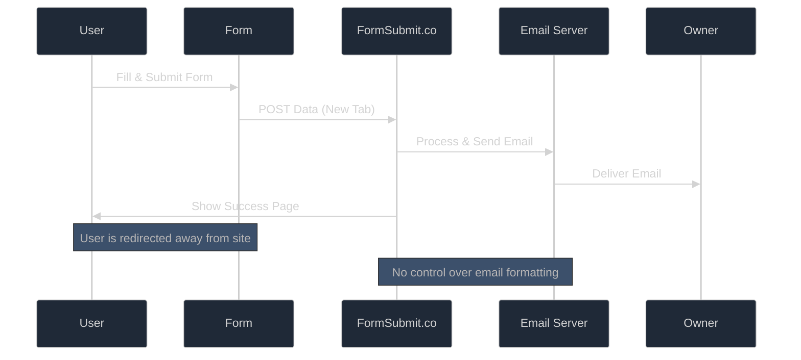

# 📊 Current State Analysis

## Overview

Analysis of the existing contact form implementation on the Johan Chan portfolio website, identifying strengths, limitations, and opportunities for improvement.

## Current Implementation

### Frontend Component

**File**: [`src/routes/contact/+page.svelte`](../../src/routes/contact/+page.svelte)

```svelte
<form target="_blank" action="https://formsubmit.co/formsubmit@mojojo.mozmail.com" method="POST">
	<!-- Form fields -->
</form>
```

### Key Features ✅

- **Internationalization**: Full i18n support via Paraglide (French/English)
- **Modern Svelte 5**: Uses latest syntax with snippets and runes
- **Accessibility**: Proper form labels and semantic HTML structure
- **Styling**: Tailwind CSS with DaisyUI theming integration
- **SEO Optimization**: Proper meta tags and structured data
- **Form Validation**: Basic HTML5 client-side validation

## Current Architecture

```mermaid
%%{init: {'theme':'dark', 'themeVariables': { 'primaryColor': '#1f2937', 'primaryTextColor': '#f9fafb', 'primaryBorderColor': '#374151', 'lineColor': '#6b7280', 'secondaryColor': '#374151', 'tertiaryColor': '#111827', 'background': '#111827', 'mainBkg': '#1f2937', 'secondBkg': '#374151'}}}%%
graph LR
    A[User Fills Form] --> B[HTML5 Validation]
    B --> C[FormSubmit.co]
    C --> D[External Redirect]
    D --> E[Email Delivery]

    style A fill:#1f2937,stroke:#3b82f6,stroke-width:2px,color:#f9fafb
    style B fill:#1f2937,stroke:#10b981,stroke-width:2px,color:#f9fafb
    style C fill:#1f2937,stroke:#f59e0b,stroke-width:2px,color:#f9fafb
    style D fill:#1f2937,stroke:#ef4444,stroke-width:2px,color:#f9fafb
    style E fill:#1f2937,stroke:#6b7280,stroke-width:2px,color:#f9fafb
```



## Form Fields Analysis

| Field       | Type     | Validation            | i18n Support |
| ----------- | -------- | --------------------- | ------------ |
| **Name**    | Text     | Required              | ✅ Full      |
| **Email**   | Email    | Required, HTML5 email | ✅ Full      |
| **Message** | Textarea | Required              | ✅ Full      |

## Limitations & Issues ⚠️

### User Experience Problems

1. **External Redirect**: Form opens in new tab, users leave the site
2. **No Feedback**: No success/error messages on the original site
3. **Lost Context**: Users don't know if submission was successful
4. **Branding Break**: FormSubmit.co page doesn't match site design

### Technical Limitations

1. **No Server Control**: Cannot customize submission flow
2. **Limited Validation**: Only basic HTML5 validation available
3. **No Security Features**: No CAPTCHA, rate limiting, or spam protection
4. **External Dependency**: Reliant on third-party service availability

### Development Workflow Issues

1. **No Local Testing**: Cannot test form submissions in development
2. **No Email Templates**: Cannot customize email formatting
3. **No Analytics**: No tracking of form submission success rates
4. **Static Deployment**: Limited to GitHub Pages static hosting

## Current Email Flow



## Internationalization Status

### Message Keys Used

- `contact.page_title` - Page title
- `contact.page_description` - Meta description
- `contact.page_keywords` - SEO keywords
- `contact.heading` - Main heading
- `contact.lead_text` - Introduction text
- `contact.form_name_label` - Name field label
- `contact.form_name_placeholder` - Name field placeholder
- `contact.form_email_label` - Email field label
- `contact.form_email_placeholder` - Email field placeholder
- `contact.form_message_label` - Message field label
- `contact.form_message_placeholder` - Message field placeholder
- `contact.form_submit_button` - Submit button text

### Language Support

- **French (fr)**: Base locale, no URL prefix
- **English (en)**: Secondary locale, `/en/` URL prefix

## SEO Configuration

### Current SEO Data

**File**: [`src/lib/data/seo-data.ts`](../../src/lib/data/seo-data.ts)

```typescript
'/contact': {
  title: 'Contact & Devis - Johan Chan Développeur Freelance',
  description: 'Contactez Johan Chan, développeur freelance, pour discuter de vos projets d\'applications web et mobile.',
  keywords: 'contact développeur freelance, devis développement, projet application, développeur React disponible',
  type: 'website'
}
```

### Sitemap Status

- ✅ Listed in `static/sitemap.xml`
- ✅ Priority: 0.7 (appropriate for contact page)
- ✅ Change frequency: monthly

## Performance Metrics

### Current Performance

- **Page Load**: Fast (static HTML)
- **Form Submission**: Depends on FormSubmit.co
- **User Retention**: Poor (external redirect)

### Core Web Vitals Impact

- **LCP**: Good (simple form layout)
- **FID**: Good (minimal JavaScript)
- **CLS**: Good (stable layout)

## Security Assessment

### Current Security Features

- ✅ HTML5 input validation
- ✅ HTTPS form submission
- ❌ No CAPTCHA protection
- ❌ No rate limiting
- ❌ No spam filtering
- ❌ No server-side validation

### Vulnerability Assessment

- **Low Risk**: Static form, external processing
- **Spam Risk**: No protection against automated submissions
- **Data Risk**: Minimal (no sensitive data stored)

## Migration Drivers

### Business Impact

1. **User Experience**: Keep users engaged on the site
2. **Professional Image**: Maintain consistent branding
3. **Control**: Full control over submission flow and email formatting
4. **Analytics**: Track form performance and user behavior

### Technical Benefits

1. **Development Workflow**: Local testing and iteration
2. **Customization**: Custom email templates and validation
3. **Security**: Implement proper spam protection
4. **Scalability**: Prepare for future enhancements

## Conclusion

The current implementation serves its basic purpose but lacks the control and user experience expected from a professional portfolio. The migration to a fullstack solution will address all identified limitations while maintaining the existing strengths.

### Next Steps

1. Review [Migration Strategy](02-migration-strategy.md)
2. Understand [Architecture Design](03-architecture-design.md)
3. Begin with [Environment Setup](04-environment-setup.md)

---

**Analysis Date**: December 26, 2025  
**Analyzed By**: System Architect  
**Status**: Complete
