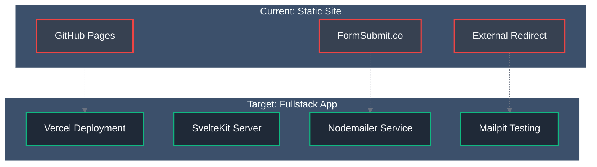
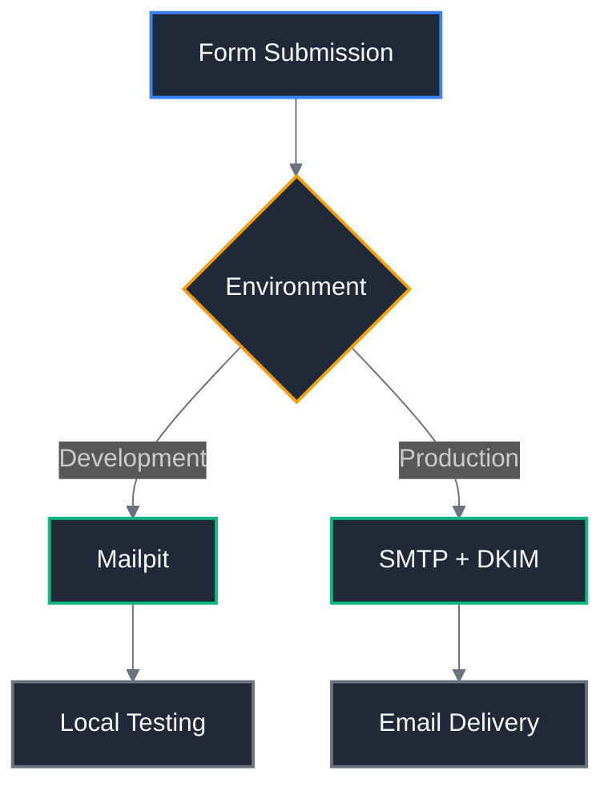
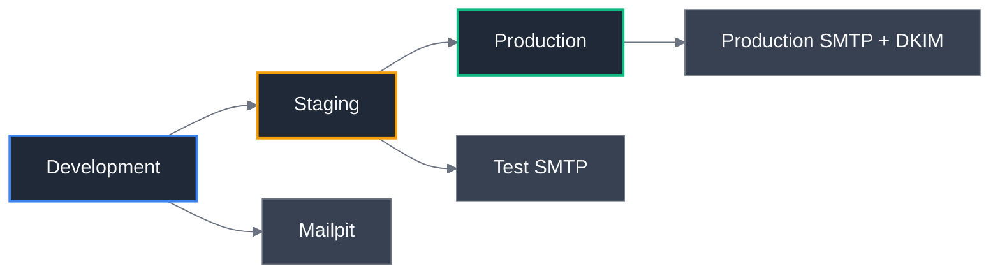
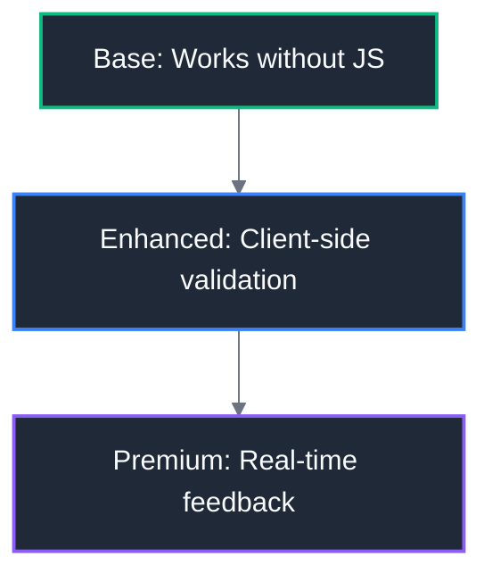

# 🎯 Migration Strategy

## Strategic Overview

Transform the contact form from a static GitHub Pages implementation to a fullstack SvelteKit application with complete control over the user experience and email delivery process.

## Migration Goals

### Primary Objectives

1. **User Experience**: Keep users on-site throughout the entire form submission process
2. **Control**: Full control over validation, email formatting, and error handling
3. **Professional**: Maintain consistent branding and user experience
4. **Reliability**: Implement proper error handling and feedback mechanisms

### Technical Objectives

1. **Server-Side Processing**: Implement SvelteKit form actions for robust form handling
2. **Email Service**: Replace FormSubmit.co with Nodemailer for custom email delivery
3. **Development Workflow**: Integrate Mailpit for local email testing
4. **Production Ready**: DKIM support for optimal email deliverability

## Migration Approach

### From Static to Fullstack

## Technology Stack Decisions

### Core Technologies

| Component           | Current          | Target            | Rationale                                     |
| ------------------- | ---------------- | ----------------- | --------------------------------------------- |
| **Hosting**         | GitHub Pages     | Vercel            | Server-side functionality required            |
| **Form Processing** | FormSubmit.co    | SvelteKit Actions | Full control over submission flow             |
| **Email Service**   | External Service | Nodemailer        | Custom templates and DKIM support             |
| **Validation**      | HTML5 Only       | Zod + HTML5       | Server-side validation with type safety       |
| **Dev Testing**     | None             | Mailpit           | Local email testing without external services |

### Email Strategy

## Implementation Strategy

### Incremental Migration Approach

We'll implement the migration in small, testable chunks to minimize risk and ensure each component works correctly before moving to the next.

#### Phase-Based Implementation

```mermaid
%%{init: {'theme':'dark', 'themeVariables': { 'primaryColor': '#1f2937', 'primaryTextColor': '#f9fafb', 'primaryBorderColor': '#374151', 'lineColor': '#6b7280', 'secondaryColor': '#374151', 'tertiaryColor': '#111827', 'background': '#111827', 'mainBkg': '#1f2937', 'secondBkg': '#374151'}}}%%
gantt
    title Implementation Timeline
    dateFormat X
    axisFormat %s

    section Foundation
    Mailpit Setup           :active, phase1, 0, 1
    Email Service          :phase2, after phase1, 1

    section Core Logic
    Validation Schema      :phase3, after phase2, 1
    Server Actions         :phase4, after phase3, 1

    section Integration
    Frontend Integration   :phase5, after phase4, 1
    DKIM Production       :phase6, after phase5, 1

    section Enhancement
    UX Polish             :phase7, after phase6, 1
```

### Risk Mitigation

#### Rollback Strategy

- Each phase is independently reversible
- Maintain FormSubmit.co as fallback during development
- Feature flags for gradual rollout

#### Testing Strategy

- Unit tests for each component
- Integration tests for email flow
- Manual testing with Mailpit
- Production validation with test emails

## Deployment Strategy

### Platform Migration

#### Current: GitHub Pages

- ✅ Simple static hosting
- ❌ No server-side functionality
- ❌ Limited to static content

#### Target: Vercel

- ✅ SvelteKit native support
- ✅ Serverless functions
- ✅ Automatic deployments
- ✅ Environment variable management
- ✅ Edge network for performance

### Environment Strategy

## Security Strategy

### Current Security Gaps

- No server-side validation
- No spam protection
- No rate limiting
- Vulnerable to automated submissions

### Target Security Features

#### Immediate Implementation

- **Zod Validation**: Server-side form validation with TypeScript safety
- **Input Sanitization**: Prevent XSS and injection attacks
- **CSRF Protection**: SvelteKit built-in CSRF protection

#### Future Enhancements (Nice-to-Have)

- **Rate Limiting**: Prevent spam and abuse
- **CAPTCHA**: Human verification for suspicious activity
- **IP Blocking**: Block known spam sources

## User Experience Strategy

### Current UX Issues

1. **Context Loss**: Users redirected away from site
2. **No Feedback**: Unclear if submission was successful
3. **Branding Break**: External success page doesn't match site
4. **Mobile Issues**: New tab behavior on mobile devices

### Target UX Improvements

#### Progressive Enhancement

#### Feedback System

- **Loading States**: Show submission in progress
- **Success Messages**: Clear confirmation of successful submission
- **Error Handling**: Helpful error messages with retry options
- **Form Persistence**: Maintain form data on validation errors

## Internationalization Preservation

### Current i18n Features

- ✅ Full French/English support
- ✅ Proper message organization
- ✅ SEO meta tag translations

### Migration Considerations

- **Maintain all existing message keys**
- **Add new messages for error states**
- **Preserve URL structure and language routing**
- **Ensure email templates support both languages**

## Success Metrics

### User Experience Metrics

- **Submission Success Rate**: Target >95%
- **User Retention**: Users stay on site after submission
- **Form Completion Rate**: Measure drop-off points
- **Mobile Experience**: Consistent behavior across devices

### Technical Metrics

- **Email Deliverability**: >98% delivery rate with DKIM
- **Response Time**: <2s form submission processing
- **Error Rate**: <1% server errors
- **Uptime**: >99.9% availability

### Development Metrics

- **Local Testing**: 100% email tests run locally
- **Deployment Speed**: Automated CI/CD pipeline
- **Rollback Time**: <5 minutes if issues arise

## Next Steps

1. **Review Architecture**: Read [Architecture Design](03-architecture-design.md)
2. **Environment Setup**: Configure [Environment Setup](04-environment-setup.md)
3. **Begin Implementation**: Start with [Phase 1: Mailpit Setup](implementation/phase-1-mailpit-setup.md)

---

**Strategy Version**: 1.0  
**Last Updated**: December 26, 2025  
**Status**: Approved for Implementation
