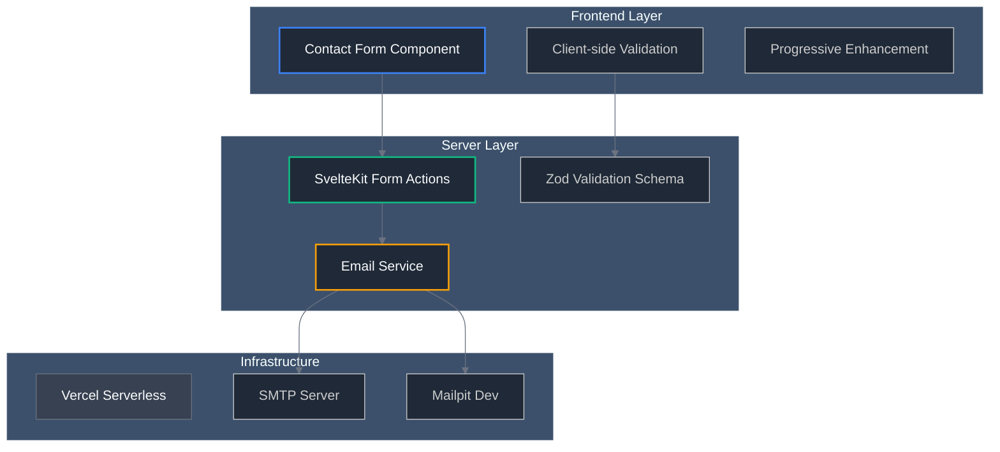
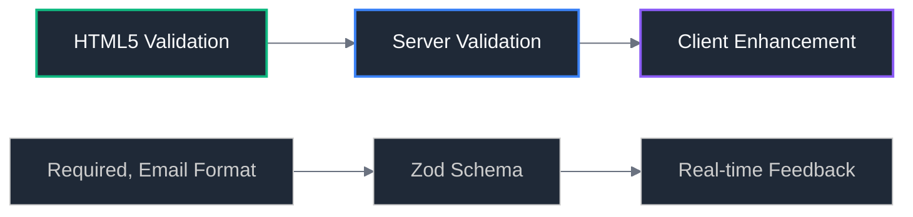
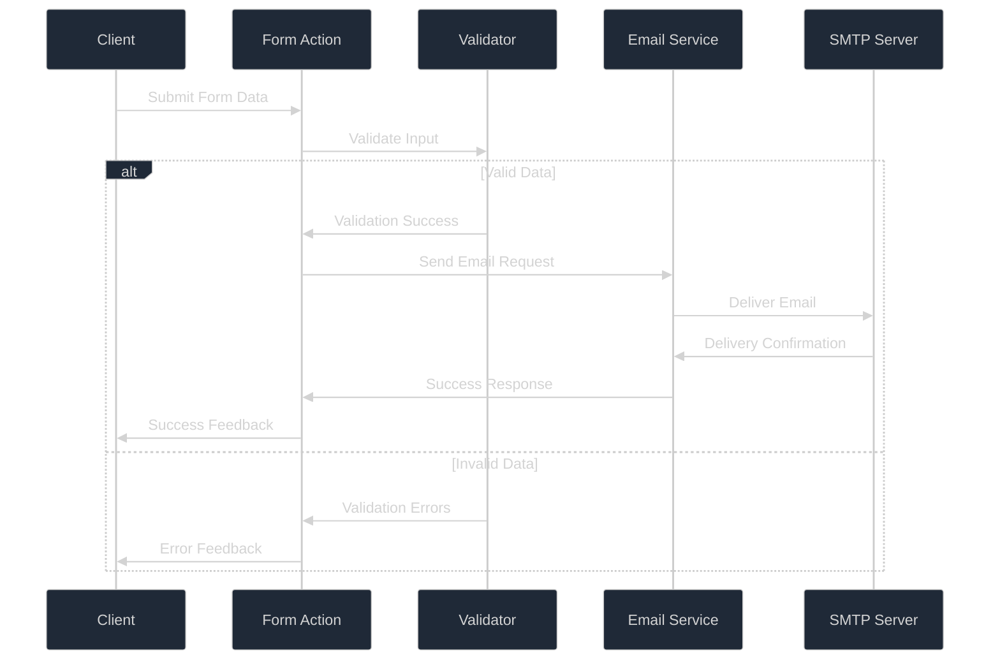
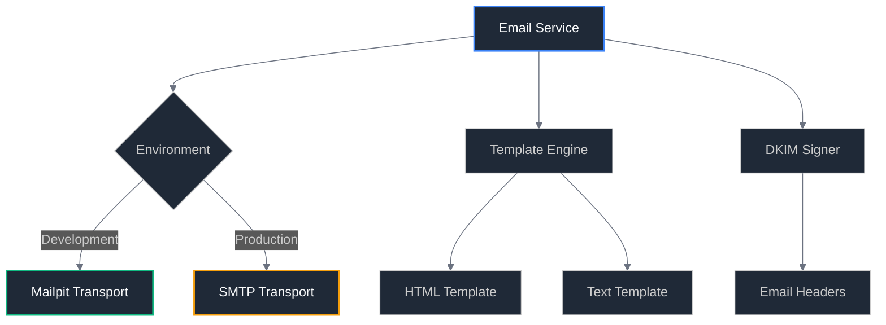
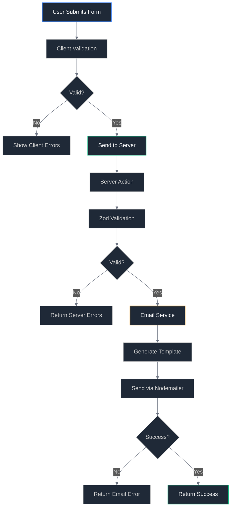
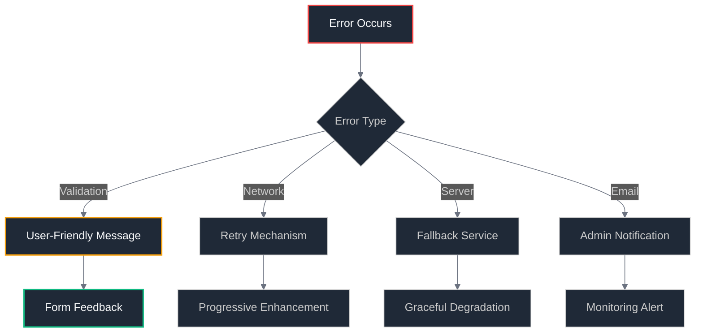
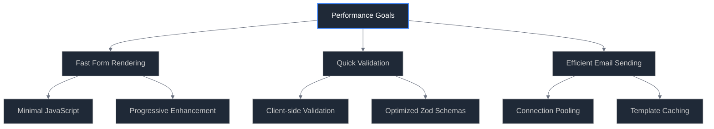
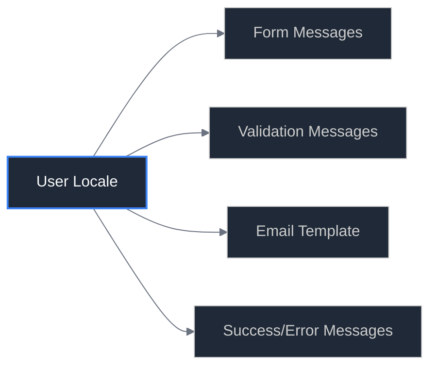
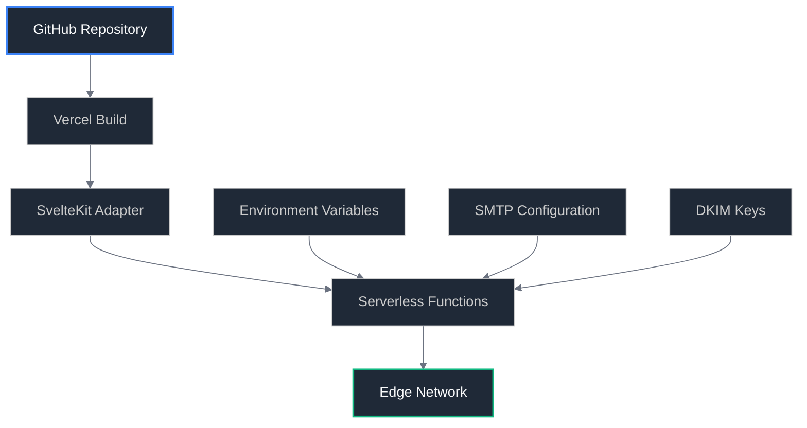

# 🏗️ Architecture Design

## System Architecture Overview

The new contact form architecture follows modern fullstack patterns with clear separation of concerns, robust error handling, and scalable email delivery.

## High-Level Architecture



## Component Architecture

### Frontend Components

#### Contact Form Component

**File**: `src/routes/contact/+page.svelte`

```typescript
interface ContactFormProps {
	// Form state management
	isSubmitting: boolean;
	errors: ValidationErrors | null;
	success: boolean;

	// Form data
	formData: ContactFormData;

	// Internationalization
	messages: ContactMessages;
}
```

**Responsibilities**:

- Render form UI with proper accessibility
- Handle client-side validation (progressive enhancement)
- Manage form state and user feedback
- Maintain internationalization support

#### Form Validation

**Progressive Enhancement Strategy**:



### Server Components

#### Form Actions

**File**: `src/routes/contact/+page.server.ts`

```typescript
export const actions = {
	default: async ({ request, getClientAddress }) => {
		// 1. Parse form data
		// 2. Validate with Zod schema
		// 3. Rate limiting check
		// 4. Send email via service
		// 5. Return success/error response
	}
};
```

**Request Flow**:



#### Validation Schema

**File**: `src/lib/schemas/contact.ts`

```typescript
import { z } from 'zod';

export const contactSchema = z.object({
	name: z
		.string()
		.min(2, 'Name must be at least 2 characters')
		.max(100, 'Name must be less than 100 characters')
		.trim(),

	email: z.string().email('Please enter a valid email address').max(255, 'Email address too long'),

	message: z
		.string()
		.min(10, 'Message must be at least 10 characters')
		.max(2000, 'Message must be less than 2000 characters')
		.trim()
});

export type ContactFormData = z.infer<typeof contactSchema>;
```

#### Email Service

**File**: `src/lib/server/email.ts`

```typescript
interface EmailService {
	sendContactEmail(data: ContactFormData): Promise<EmailResult>;
	generateEmailTemplate(data: ContactFormData, locale: string): EmailTemplate;
	validateDKIMConfiguration(): Promise<boolean>;
}
```

**Email Architecture**:



## Data Flow Architecture

### Form Submission Flow



### Error Handling Strategy



## Environment Configuration

### Development Environment

```typescript
// Development Configuration
const devConfig = {
	email: {
		transport: 'mailpit',
		host: 'localhost',
		port: 1025,
		secure: false,
		auth: null
	},
	validation: {
		strict: true,
		logging: true
	},
	security: {
		rateLimit: false,
		captcha: false
	}
};
```

### Production Environment

```typescript
// Production Configuration
const prodConfig = {
	email: {
		transport: 'smtp',
		host: process.env.SMTP_HOST,
		port: parseInt(process.env.SMTP_PORT),
		secure: true,
		auth: {
			user: process.env.SMTP_USER,
			pass: process.env.SMTP_PASS
		},
		dkim: {
			domainName: process.env.DKIM_DOMAIN,
			keySelector: process.env.DKIM_SELECTOR,
			privateKey: process.env.DKIM_PRIVATE_KEY
		}
	},
	validation: {
		strict: true,
		logging: false
	},
	security: {
		rateLimit: true,
		captcha: 'conditional'
	}
};
```

## Security Architecture

### Input Validation

```mermaid
%%{init: {'theme':'dark', 'themeVariables': { 'primaryColor': '#1f2937', 'primaryTextColor': '#f9fafb', 'primaryBorderColor': '#374151', 'lineColor': '#6b7280', 'secondaryColor': '#374151', 'tertiaryColor': '#111827', 'background': '#111827', 'mainBkg': '#1f2937', 'secondBkg': '#374151'}}}%%
graph LR
    A[Raw Input] --> B[HTML5 Validation]
    B --> C[Zod Schema Validation]
    C --> D[Sanitization]
    D --> E[Business Logic Validation]
    E --> F[Safe Data]

    style A fill:#374151,stroke:#ef4444,stroke-width:2px,color:#f9fafb
    style F fill:#1f2937,stroke:#10b981,stroke-width:2px,color:#f9fafb
```



### Security Layers

| Layer           | Implementation     | Purpose                               |
| --------------- | ------------------ | ------------------------------------- |
| **Client**      | HTML5 + JavaScript | User experience, immediate feedback   |
| **Transport**   | HTTPS              | Data encryption in transit            |
| **Server**      | Zod Validation     | Type safety and data validation       |
| **Application** | SvelteKit CSRF     | Cross-site request forgery protection |
| **Email**       | DKIM Signing       | Email authenticity and deliverability |

## Performance Considerations

### Optimization Strategy



### Metrics & Monitoring

- **Form Load Time**: Target <1s
- **Validation Response**: Target <100ms
- **Email Delivery**: Target <5s
- **Error Rate**: Target <1%

## Internationalization Architecture

### Message Management

```typescript
// Message Structure
interface ContactMessages {
	form: {
		labels: FormLabels;
		placeholders: FormPlaceholders;
		errors: ValidationErrors;
		success: SuccessMessages;
	};
	email: {
		subject: string;
		templates: EmailTemplates;
	};
}
```

### Language Support Flow



## Deployment Architecture

### Vercel Integration



## Future Architecture Considerations

### Scalability Enhancements

1. **Database Integration**: Store form submissions for analytics
2. **Queue System**: Handle high-volume email sending
3. **CDN Integration**: Optimize static asset delivery
4. **Monitoring**: Application performance monitoring

### Security Enhancements

1. **Rate Limiting**: Implement request throttling
2. **CAPTCHA**: Add human verification
3. **WAF Integration**: Web application firewall
4. **Audit Logging**: Track all form submissions

## Next Steps

1. **Environment Setup**: Configure [Environment Setup](04-environment-setup.md)
2. **Testing Strategy**: Review [Testing Strategy](05-testing-strategy.md)
3. **Implementation**: Begin [Phase 1: Mailpit Setup](implementation/phase-1-mailpit-setup.md)

---

**Architecture Version**: 1.0  
**Last Updated**: December 26, 2025  
**Status**: Design Complete
