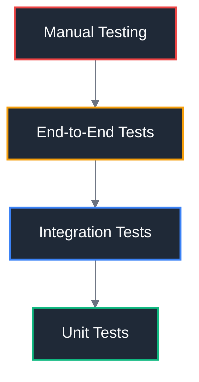
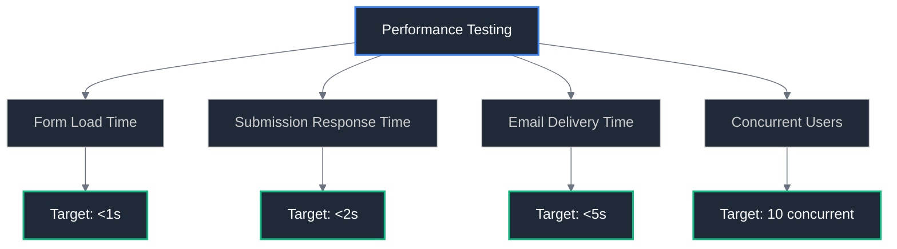

# 🧪 Testing Strategy

## Overview

Comprehensive testing approach to ensure the contact form migration is reliable, secure, and provides an excellent user experience across all environments and scenarios.

## Testing Pyramid



## Unit Testing

### Validation Schema Tests

**File**: `src/lib/schemas/contact.test.ts`

```typescript
import { describe, it, expect } from 'vitest';
import { contactSchema } from './contact';

describe('Contact Form Validation', () => {
	it('should validate correct form data', () => {
		const validData = {
			name: 'John Doe',
			email: 'john@example.com',
			message: 'This is a valid message.'
		};

		const result = contactSchema.safeParse(validData);
		expect(result.success).toBe(true);
	});

	it('should reject invalid email', () => {
		const invalidData = {
			name: 'John Doe',
			email: 'invalid-email',
			message: 'Valid message'
		};

		const result = contactSchema.safeParse(invalidData);
		expect(result.success).toBe(false);
		expect(result.error?.issues[0].path).toEqual(['email']);
	});

	it('should reject short names', () => {
		const invalidData = {
			name: 'J',
			email: 'john@example.com',
			message: 'Valid message'
		};

		const result = contactSchema.safeParse(invalidData);
		expect(result.success).toBe(false);
	});

	it('should reject long messages', () => {
		const invalidData = {
			name: 'John Doe',
			email: 'john@example.com',
			message: 'x'.repeat(2001)
		};

		const result = contactSchema.safeParse(invalidData);
		expect(result.success).toBe(false);
	});
});
```

### Email Service Tests

**File**: `src/lib/server/email.test.ts`

```typescript
import { describe, it, expect, vi, beforeEach } from 'vitest';
import { EmailService } from './email';

describe('Email Service', () => {
	let emailService: EmailService;

	beforeEach(() => {
		emailService = new EmailService();
	});

	it('should generate HTML email template', () => {
		const data = {
			name: 'John Doe',
			email: 'john@example.com',
			message: 'Test message'
		};

		const template = emailService.generateTemplate(data, 'en');

		expect(template.html).toContain('John Doe');
		expect(template.html).toContain('john@example.com');
		expect(template.html).toContain('Test message');
	});

	it('should generate text email template', () => {
		const data = {
			name: 'John Doe',
			email: 'john@example.com',
			message: 'Test message'
		};

		const template = emailService.generateTemplate(data, 'en');

		expect(template.text).toContain('John Doe');
		expect(template.text).toContain('john@example.com');
		expect(template.text).toContain('Test message');
	});

	it('should support French locale', () => {
		const data = {
			name: 'Jean Dupont',
			email: 'jean@example.com',
			message: 'Message de test'
		};

		const template = emailService.generateTemplate(data, 'fr');

		expect(template.subject).toContain('Message de');
		expect(template.html).toContain('jean@example.com');
	});
});
```

## Integration Testing

### Form Action Tests

**File**: `src/routes/contact/+page.server.test.ts`

```typescript
import { describe, it, expect, vi, beforeEach } from 'vitest';
import { actions } from './+page.server';

describe('Contact Form Actions', () => {
	beforeEach(() => {
		vi.clearAllMocks();
	});

	it('should process valid form submission', async () => {
		const formData = new FormData();
		formData.append('name', 'John Doe');
		formData.append('email', 'john@example.com');
		formData.append('message', 'Test message');

		const request = new Request('http://localhost', {
			method: 'POST',
			body: formData
		});

		const result = await actions.default({
			request,
			getClientAddress: () => '127.0.0.1'
		});

		expect(result.success).toBe(true);
	});

	it('should return validation errors for invalid data', async () => {
		const formData = new FormData();
		formData.append('name', '');
		formData.append('email', 'invalid');
		formData.append('message', '');

		const request = new Request('http://localhost', {
			method: 'POST',
			body: formData
		});

		const result = await actions.default({
			request,
			getClientAddress: () => '127.0.0.1'
		});

		expect(result.success).toBe(false);
		expect(result.errors).toBeDefined();
	});
});
```

### Email Integration Tests

**File**: `tests/integration/email.test.ts`

```typescript
import { describe, it, expect, beforeAll, afterAll } from 'vitest';
import { EmailService } from '../../src/lib/server/email';

describe('Email Integration', () => {
	let emailService: EmailService;

	beforeAll(() => {
		// Ensure Mailpit is running for integration tests
		emailService = new EmailService();
	});

	it('should send email to Mailpit in development', async () => {
		const testData = {
			name: 'Integration Test',
			email: 'test@example.com',
			message: 'This is an integration test message.'
		};

		const result = await emailService.sendContactEmail(testData);

		expect(result.success).toBe(true);
		expect(result.messageId).toBeDefined();
	});

	it('should handle email sending failures gracefully', async () => {
		// Mock a failure scenario
		const invalidData = {
			name: 'Test',
			email: 'invalid-email-format',
			message: 'Test'
		};

		// This should be caught and handled properly
		const result = await emailService.sendContactEmail(invalidData);

		// Should not throw, but return error result
		expect(result.success).toBe(false);
		expect(result.error).toBeDefined();
	});
});
```

## End-to-End Testing

### Playwright Test Setup

**File**: `tests/e2e/contact-form.spec.ts`

```typescript
import { test, expect } from '@playwright/test';

test.describe('Contact Form', () => {
	test.beforeEach(async ({ page }) => {
		await page.goto('/contact');
	});

	test('should display contact form', async ({ page }) => {
		await expect(page.locator('h1')).toContainText('Get in touch');
		await expect(page.locator('input[name="name"]')).toBeVisible();
		await expect(page.locator('input[name="email"]')).toBeVisible();
		await expect(page.locator('textarea[name="message"]')).toBeVisible();
		await expect(page.locator('button[type="submit"]')).toBeVisible();
	});

	test('should submit form successfully', async ({ page }) => {
		await page.fill('input[name="name"]', 'John Doe');
		await page.fill('input[name="email"]', 'john@example.com');
		await page.fill('textarea[name="message"]', 'This is a test message.');

		await page.click('button[type="submit"]');

		// Should show success message
		await expect(page.locator('.success-message')).toBeVisible();
		await expect(page.locator('.success-message')).toContainText('Message sent successfully');
	});

	test('should show validation errors', async ({ page }) => {
		// Submit empty form
		await page.click('button[type="submit"]');

		// Should show validation errors
		await expect(page.locator('.error-message')).toBeVisible();
		await expect(page.locator('input[name="name"]:invalid')).toBeVisible();
		await expect(page.locator('input[name="email"]:invalid')).toBeVisible();
	});

	test('should work without JavaScript', async ({ page, context }) => {
		// Disable JavaScript
		await context.setJavaScriptEnabled(false);
		await page.reload();

		await page.fill('input[name="name"]', 'No JS User');
		await page.fill('input[name="email"]', 'nojs@example.com');
		await page.fill('textarea[name="message"]', 'Testing without JavaScript.');

		await page.click('button[type="submit"]');

		// Should still work (server-side processing)
		await expect(page.locator('.success-message')).toBeVisible();
	});

	test('should maintain form data on validation errors', async ({ page }) => {
		const name = 'Persistent User';
		const message = 'This data should persist.';

		await page.fill('input[name="name"]', name);
		await page.fill('input[name="email"]', 'invalid-email');
		await page.fill('textarea[name="message"]', message);

		await page.click('button[type="submit"]');

		// After validation error, form data should be preserved
		await expect(page.locator('input[name="name"]')).toHaveValue(name);
		await expect(page.locator('textarea[name="message"]')).toHaveValue(message);
	});
});
```

### Mailpit Integration Tests

**File**: `tests/e2e/mailpit.spec.ts`

```typescript
import { test, expect } from '@playwright/test';

test.describe('Mailpit Integration', () => {
	test('should receive email in Mailpit', async ({ page }) => {
		// Submit contact form
		await page.goto('/contact');
		await page.fill('input[name="name"]', 'Mailpit Test');
		await page.fill('input[name="email"]', 'mailpit@example.com');
		await page.fill('textarea[name="message"]', 'Testing Mailpit integration.');
		await page.click('button[type="submit"]');

		// Wait for success
		await expect(page.locator('.success-message')).toBeVisible();

		// Check Mailpit interface
		await page.goto('http://localhost:8025');

		// Should see the email in Mailpit
		await expect(page.locator('.email-list')).toContainText('Mailpit Test');

		// Click on email to view details
		await page.click('.email-list tr:first-child');

		// Verify email content
		await expect(page.locator('.email-content')).toContainText('mailpit@example.com');
		await expect(page.locator('.email-content')).toContainText('Testing Mailpit integration');
	});
});
```

## Performance Testing

### Load Testing Strategy



### Performance Test Script

**File**: `tests/performance/contact-form.js`

```javascript
import http from 'k6/http';
import { check, sleep } from 'k6';

export let options = {
	stages: [
		{ duration: '30s', target: 5 }, // Ramp up
		{ duration: '1m', target: 10 }, // Stay at 10 users
		{ duration: '30s', target: 0 } // Ramp down
	]
};

export default function () {
	// Test form page load
	let response = http.get('http://localhost:5173/contact');
	check(response, {
		'form page loads': (r) => r.status === 200,
		'form page load time': (r) => r.timings.duration < 1000
	});

	// Test form submission
	let formData = {
		name: 'Load Test User',
		email: 'loadtest@example.com',
		message: 'This is a load test message.'
	};

	response = http.post('http://localhost:5173/contact', formData);
	check(response, {
		'form submission successful': (r) => r.status === 200,
		'form submission time': (r) => r.timings.duration < 2000
	});

	sleep(1);
}
```

## Security Testing

### Security Test Checklist

#### Input Validation Tests

- [ ] **XSS Prevention**: Test script injection in all form fields
- [ ] **SQL Injection**: Test database injection attempts (if database added)
- [ ] **Large Payloads**: Test with oversized form data
- [ ] **Special Characters**: Test with Unicode and special characters

#### Authentication & Authorization Tests

- [ ] **CSRF Protection**: Test cross-site request forgery protection
- [ ] **Rate Limiting**: Test submission frequency limits
- [ ] **Input Sanitization**: Verify all inputs are properly sanitized

#### Email Security Tests

- [ ] **Header Injection**: Test email header injection attempts
- [ ] **DKIM Verification**: Verify DKIM signatures are valid
- [ ] **SPF Compliance**: Test SPF record validation

### Security Test Examples

**File**: `tests/security/contact-form.spec.ts`

```typescript
import { test, expect } from '@playwright/test';

test.describe('Security Tests', () => {
	test('should prevent XSS attacks', async ({ page }) => {
		await page.goto('/contact');

		const xssPayload = '<script>alert("XSS")</script>';

		await page.fill('input[name="name"]', xssPayload);
		await page.fill('input[name="email"]', 'test@example.com');
		await page.fill('textarea[name="message"]', xssPayload);

		await page.click('button[type="submit"]');

		// Should not execute script
		await expect(page.locator('script')).toHaveCount(0);

		// Should show success or validation error, not script execution
		const hasSuccess = await page.locator('.success-message').isVisible();
		const hasError = await page.locator('.error-message').isVisible();
		expect(hasSuccess || hasError).toBe(true);
	});

	test('should handle large payloads gracefully', async ({ page }) => {
		await page.goto('/contact');

		const largePayload = 'x'.repeat(10000);

		await page.fill('input[name="name"]', 'Test User');
		await page.fill('input[name="email"]', 'test@example.com');
		await page.fill('textarea[name="message"]', largePayload);

		await page.click('button[type="submit"]');

		// Should show validation error for message too long
		await expect(page.locator('.error-message')).toBeVisible();
	});
});
```

## Test Environment Setup

### Development Testing

```bash
# Install testing dependencies
pnpm add -D vitest @vitest/ui playwright @playwright/test

# Run unit tests
pnpm test:unit

# Run integration tests (requires Mailpit)
pnpm test:integration

# Run E2E tests
pnpm test:e2e
```

### CI/CD Testing Pipeline

```yaml
# .github/workflows/test.yml
name: Test Contact Form

on: [push, pull_request]

jobs:
  test:
    runs-on: ubuntu-latest

    services:
      mailpit:
        image: axllent/mailpit
        ports:
          - 8025:8025
          - 1025:1025

    steps:
      - uses: actions/checkout@v3

      - name: Setup Node.js
        uses: actions/setup-node@v3
        with:
          node-version: '18'

      - name: Install dependencies
        run: pnpm install

      - name: Run unit tests
        run: pnpm test:unit

      - name: Run integration tests
        run: pnpm test:integration
        env:
          MAILPIT_HOST: localhost
          MAILPIT_PORT: 1025

      - name: Run E2E tests
        run: pnpm test:e2e
```

## Test Data Management

### Test Data Factory

**File**: `tests/fixtures/contact-data.ts`

```typescript
export const validContactData = {
	name: 'John Doe',
	email: 'john@example.com',
	message: 'This is a valid test message.'
};

export const invalidContactData = {
	emptyName: {
		name: '',
		email: 'john@example.com',
		message: 'Valid message'
	},
	invalidEmail: {
		name: 'John Doe',
		email: 'invalid-email',
		message: 'Valid message'
	},
	longMessage: {
		name: 'John Doe',
		email: 'john@example.com',
		message: 'x'.repeat(2001)
	}
};

export const xssTestData = {
	name: '<script>alert("XSS")</script>',
	email: 'test@example.com',
	message: ''
};
```

## Monitoring & Reporting

### Test Coverage Goals

- **Unit Tests**: >90% coverage
- **Integration Tests**: All API endpoints covered
- **E2E Tests**: All user flows covered
- **Security Tests**: All attack vectors tested

### Test Reporting

```bash
# Generate test coverage report
pnpm test:coverage

# Generate E2E test report
pnpm test:e2e --reporter=html

# Generate performance test report
k6 run --out json=results.json tests/performance/contact-form.js
```

## Next Steps

1. **Deployment Guide**: Review [Deployment Guide](06-deployment-guide.md)
2. **Implementation**: Start [Phase 1: Mailpit Setup](implementation/phase-1-mailpit-setup.md)
3. **Troubleshooting**: Reference [Troubleshooting](07-troubleshooting.md)

---

**Testing Strategy Version**: 1.0  
**Last Updated**: December 26, 2025  
**Status**: Ready for Implementation
