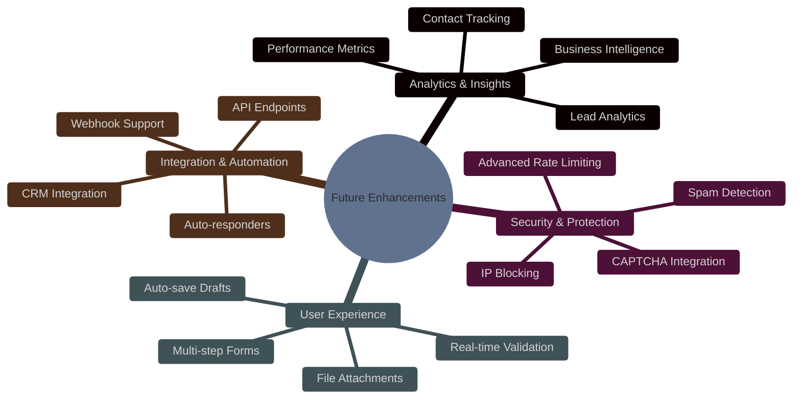
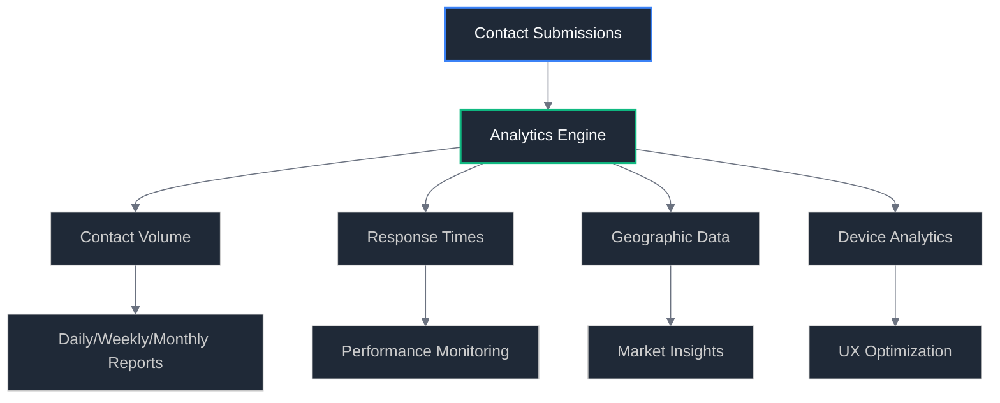

# 🌟 Future Enhancements

## Overview

This document outlines potential enhancements and nice-to-have features for the contact form system. These features are not part of the initial migration but represent opportunities for future development and improvement.

## Enhancement Categories



## Priority Matrix

| Enhancement              | Impact | Effort | Priority  |
| ------------------------ | ------ | ------ | --------- |
| **Database Analytics**   | High   | Medium | 🟢 High   |
| **Rate Limiting**        | High   | Low    | 🟢 High   |
| **Real-time Validation** | Medium | Low    | 🟡 Medium |
| **CAPTCHA Integration**  | Medium | Medium | 🟡 Medium |
| **File Attachments**     | Medium | High   | 🟡 Medium |
| **CRM Integration**      | High   | High   | 🔴 Low    |
| **Auto-responders**      | Low    | Medium | 🔴 Low    |

## Phase 1: Analytics & Data Management

### Database Integration

#### Contact Submission Storage

**Goal**: Store all contact form submissions for analytics and backup purposes.

**Benefits**:

- **Data Backup**: Ensure no contact submissions are lost due to email failures
- **Analytics**: Track contact patterns, peak times, and user behavior
- **Lead Management**: Better tracking of potential clients and follow-up
- **Performance Monitoring**: Analyze form completion rates and drop-off points

**Implementation Overview**:

```typescript
// Database Schema
interface ContactSubmission {
	id: string;
	name: string;
	email: string;
	message: string;
	submittedAt: Date;
	ipAddress: string;
	userAgent: string;
	locale: string;
	emailSent: boolean;
	emailSentAt?: Date;
	responseTime?: number;
}
```

**Technology Options**:

- **Vercel Postgres**: Managed PostgreSQL database
- **PlanetScale**: MySQL-compatible serverless database
- **Supabase**: PostgreSQL with real-time features
- **Turso**: SQLite-based edge database

**Analytics Dashboard**:



#### Lead Scoring System

**Goal**: Automatically score and prioritize contact submissions based on various factors.

**Scoring Factors**:

- Message length and quality
- Email domain (business vs. personal)
- Time of submission
- Geographic location
- Referral source

**Implementation**:

```typescript
interface LeadScore {
	submissionId: string;
	score: number; // 0-100
	factors: {
		messageQuality: number;
		emailDomain: number;
		timing: number;
		geography: number;
		referralSource: number;
	};
	priority: 'low' | 'medium' | 'high' | 'urgent';
}
```

### Business Intelligence Dashboard

#### Key Metrics Tracking

**Contact Volume Metrics**:

- Submissions per day/week/month
- Peak submission times
- Seasonal trends
- Conversion funnel analysis

**Quality Metrics**:

- Average message length
- Response time to contacts
- Follow-up success rates
- Client acquisition rates

**Technical Metrics**:

- Form completion rates
- Validation error frequency
- Email delivery success rates
- Performance benchmarks

## Phase 2: Enhanced Security

### Advanced Rate Limiting

#### Intelligent Rate Limiting

**Goal**: Implement sophisticated rate limiting that adapts to user behavior patterns.

**Features**:

- **Adaptive Limits**: Adjust limits based on user behavior
- **Whitelist Management**: Trusted IPs and domains
- **Suspicious Activity Detection**: Automated threat detection
- **Geographic Restrictions**: Region-based access control

**Implementation**:

```typescript
interface RateLimitRule {
	id: string;
	type: 'ip' | 'email' | 'fingerprint';
	window: number; // milliseconds
	maxRequests: number;
	blockDuration: number;
	conditions: {
		geography?: string[];
		userAgent?: string[];
		referrer?: string[];
	};
}
```

#### Behavioral Analysis

**Spam Detection Patterns**:

- Rapid successive submissions
- Identical message content
- Suspicious email patterns
- Bot-like behavior indicators

### CAPTCHA Integration

#### Conditional CAPTCHA

**Goal**: Show CAPTCHA only when suspicious activity is detected.

**Trigger Conditions**:

- Multiple submissions from same IP
- Suspicious message content patterns
- High-risk geographic regions
- Bot-like submission patterns

**Implementation Options**:

- **hCaptcha**: Privacy-focused CAPTCHA
- **Cloudflare Turnstile**: Invisible CAPTCHA
- **Google reCAPTCHA v3**: Risk scoring

```typescript
interface CaptchaConfig {
	provider: 'hcaptcha' | 'turnstile' | 'recaptcha';
	threshold: number; // Risk score threshold
	triggers: {
		rateLimit: boolean;
		suspiciousContent: boolean;
		highRiskGeo: boolean;
		botDetection: boolean;
	};
}
```

### Advanced Spam Protection

#### Content Analysis

**Message Quality Scoring**:

- Language detection and validation
- Spam keyword detection
- Message coherence analysis
- Professional language indicators

**Email Validation**:

- Disposable email detection
- Domain reputation checking
- MX record validation
- Email deliverability scoring

## Phase 3: User Experience Enhancements

### Real-time Form Validation

#### Progressive Validation

**Goal**: Provide immediate feedback as users type, improving form completion rates.

**Features**:

- **Field-level Validation**: Instant feedback per field
- **Async Email Validation**: Check email deliverability
- **Smart Suggestions**: Auto-correct common mistakes
- **Accessibility**: Screen reader compatible feedback

```typescript
interface ValidationState {
	field: string;
	status: 'idle' | 'validating' | 'valid' | 'invalid';
	message?: string;
	suggestions?: string[];
}
```

#### Smart Form Features

**Auto-completion**:

- Browser autofill integration
- Smart field detection
- Address and contact information suggestions

**Form Recovery**:

- Auto-save draft messages
- Session restoration
- Cross-device synchronization

### File Attachments

#### Document Upload Support

**Goal**: Allow users to attach relevant documents (CV, project briefs, etc.).

**Features**:

- **File Type Validation**: PDF, DOC, images only
- **Size Limits**: Reasonable file size restrictions
- **Virus Scanning**: Security scanning for uploads
- **Cloud Storage**: Integration with cloud storage providers

**Implementation Considerations**:

```typescript
interface FileAttachment {
	id: string;
	filename: string;
	mimeType: string;
	size: number;
	uploadedAt: Date;
	virusScanned: boolean;
	storageUrl: string;
}
```

**Storage Options**:

- **Vercel Blob**: Native Vercel file storage
- **AWS S3**: Scalable object storage
- **Cloudinary**: Image and document management
- **Google Cloud Storage**: Enterprise-grade storage

### Multi-step Forms

#### Progressive Form Experience

**Goal**: Break complex forms into manageable steps for better user experience.

**Form Steps**:

1. **Contact Information**: Name, email, phone
2. **Project Details**: Type, timeline, budget
3. **Requirements**: Detailed specifications
4. **Attachments**: Supporting documents
5. **Review**: Final confirmation

**Benefits**:

- Reduced form abandonment
- Better data quality
- Improved mobile experience
- Progressive disclosure of information

## Phase 4: Integration & Automation

### CRM Integration

#### Customer Relationship Management

**Goal**: Automatically sync contact submissions with CRM systems for better lead management.

**Supported CRMs**:

- **HubSpot**: Marketing and sales automation
- **Pipedrive**: Sales pipeline management
- **Airtable**: Flexible database and CRM
- **Notion**: All-in-one workspace

**Integration Features**:

- Automatic contact creation
- Lead scoring synchronization
- Activity timeline tracking
- Follow-up task automation

```typescript
interface CRMIntegration {
	provider: 'hubspot' | 'pipedrive' | 'airtable' | 'notion';
	apiKey: string;
	mapping: {
		name: string;
		email: string;
		message: string;
		customFields: Record<string, string>;
	};
	automation: {
		createContact: boolean;
		assignOwner: boolean;
		createTask: boolean;
		sendNotification: boolean;
	};
}
```

### Auto-responder System

#### Automated Email Responses

**Goal**: Send immediate acknowledgment and follow-up emails to contacts.

**Email Types**:

- **Instant Confirmation**: Immediate receipt confirmation
- **Detailed Response**: Personalized follow-up within 24 hours
- **Project Questionnaire**: Additional information requests
- **Meeting Scheduling**: Calendar integration for consultations

**Template Management**:

```typescript
interface EmailTemplate {
	id: string;
	name: string;
	subject: string;
	htmlContent: string;
	textContent: string;
	variables: string[];
	triggers: {
		immediate: boolean;
		delayed: number; // hours
		conditions: Record<string, any>;
	};
}
```

### Webhook Support

#### External System Integration

**Goal**: Allow external systems to receive real-time notifications of contact submissions.

**Webhook Events**:

- `contact.submitted`: New contact form submission
- `contact.validated`: Form validation completed
- `email.sent`: Notification email sent successfully
- `email.failed`: Email delivery failure

**Implementation**:

```typescript
interface WebhookEndpoint {
	id: string;
	url: string;
	events: string[];
	secret: string;
	active: boolean;
	retryPolicy: {
		maxRetries: number;
		backoffMultiplier: number;
	};
}
```

### API Endpoints

#### RESTful API for External Access

**Goal**: Provide API access for external applications and integrations.

**Endpoints**:

- `POST /api/contact`: Submit contact form
- `GET /api/contact/stats`: Analytics and statistics
- `GET /api/contact/submissions`: List submissions (authenticated)
- `PUT /api/contact/settings`: Update configuration

**Authentication**:

- API key-based authentication
- Rate limiting per API key
- Scope-based permissions

## Phase 5: Advanced Features

### AI-Powered Enhancements

#### Intelligent Content Analysis

**Message Categorization**:

- Automatic project type detection
- Urgency level assessment
- Skills requirement extraction
- Budget range estimation

**Smart Routing**:

- Route inquiries to appropriate team members
- Suggest response templates
- Predict project success probability

#### Chatbot Integration

**Pre-form Assistance**:

- Guide users through form completion
- Answer common questions
- Collect preliminary information
- Reduce form abandonment

### Advanced Analytics

#### Machine Learning Insights

**Predictive Analytics**:

- Contact quality prediction
- Conversion probability scoring
- Optimal response timing
- Seasonal trend forecasting

**A/B Testing Framework**:

- Form layout optimization
- Message template testing
- Conversion rate improvement
- User experience enhancement

## Implementation Roadmap

### Short-term (1-3 months)

- [ ] Database integration for contact storage
- [ ] Basic analytics dashboard
- [ ] Enhanced rate limiting
- [ ] Real-time form validation

### Medium-term (3-6 months)

- [ ] CAPTCHA integration
- [ ] File attachment support
- [ ] Auto-responder system
- [ ] CRM integration (basic)

### Long-term (6+ months)

- [ ] AI-powered content analysis
- [ ] Advanced analytics and ML
- [ ] Multi-step form experience
- [ ] Comprehensive API platform

## Cost Considerations

### Infrastructure Costs

| Enhancement                    | Monthly Cost Estimate |
| ------------------------------ | --------------------- |
| **Database (Vercel Postgres)** | $20-50                |
| **File Storage (Vercel Blob)** | $10-30                |
| **Analytics Platform**         | $0-25                 |
| **CRM Integration**            | $0-100                |
| **AI/ML Services**             | $25-100               |

### Development Effort

| Enhancement              | Development Time |
| ------------------------ | ---------------- |
| **Database Integration** | 1-2 weeks        |
| **Analytics Dashboard**  | 2-3 weeks        |
| **File Attachments**     | 1-2 weeks        |
| **CRM Integration**      | 2-4 weeks        |
| **AI Features**          | 4-8 weeks        |

## Success Metrics

### Business Impact

- **Lead Quality**: Improved lead scoring and conversion rates
- **Response Time**: Faster response to high-priority contacts
- **Client Acquisition**: Better tracking of client acquisition funnel
- **Revenue Attribution**: Direct revenue attribution to contact sources

### Technical Metrics

- **Performance**: Maintained form submission speed (<2s)
- **Reliability**: >99.9% uptime for enhanced features
- **Security**: Zero security incidents from new features
- **User Experience**: Improved form completion rates

## Risk Assessment

### Implementation Risks

- **Complexity**: Additional features increase system complexity
- **Performance**: Database queries may slow form submissions
- **Security**: More attack surfaces with additional features
- **Maintenance**: Increased maintenance overhead

### Mitigation Strategies

- **Phased Implementation**: Gradual rollout of features
- **Performance Monitoring**: Continuous performance tracking
- **Security Audits**: Regular security assessments
- **Documentation**: Comprehensive feature documentation

## Conclusion

These future enhancements represent significant opportunities to transform the contact form from a simple communication tool into a comprehensive lead management and business intelligence platform. The modular approach allows for selective implementation based on business priorities and resource availability.

Each enhancement should be evaluated against current business needs, technical complexity, and resource constraints before implementation.

---

**Future Enhancements Version**: 1.0  
**Last Updated**: December 26, 2025  
**Status**: Strategic Planning
