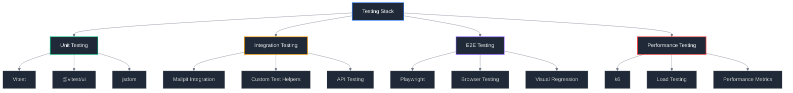

# 🧪 Testing Setup Guide

## Overview

Complete guide for setting up and configuring all testing tools required for the contact form migration project. This ensures consistent testing environments across development, CI/CD, and production validation.

## Testing Stack Overview



## Package Dependencies Setup

### Update package.json

**File**: `package.json`

```json
{
	"name": "jconan-portfolio",
	"version": "1.0.0",
	"private": true,
	"scripts": {
		"dev": "vite dev",
		"build": "vite build",
		"preview": "vite preview",
		"test": "npm run test:unit",
		"test:unit": "vitest",
		"test:unit:ui": "vitest --ui",
		"test:unit:coverage": "vitest --coverage",
		"test:integration": "vitest --config vitest.integration.config.ts",
		"test:e2e": "playwright test",
		"test:e2e:ui": "playwright test --ui",
		"test:e2e:headed": "playwright test --headed",
		"test:performance": "k6 run tests/performance/contact-form.js",
		"test:all": "npm run test:unit && npm run test:integration && npm run test:e2e",
		"test:ci": "npm run test:unit:coverage && npm run test:integration && npm run test:e2e",
		"check": "svelte-kit sync && svelte-check --tsconfig ./tsconfig.json",
		"check:watch": "svelte-kit sync && svelte-check --tsconfig ./tsconfig.json --watch",
		"lint": "prettier --check . && eslint .",
		"format": "prettier --write .",
		"mailpit:start": "docker run -d --name mailpit -p 8025:8025 -p 1025:1025 axllent/mailpit",
		"mailpit:stop": "docker stop mailpit && docker rm mailpit",
		"mailpit:restart": "npm run mailpit:stop; npm run mailpit:start",
		"email:test": "tsx scripts/test-email.ts"
	},
	"devDependencies": {
		"@playwright/test": "^1.40.0",
		"@sveltejs/adapter-auto": "^2.0.0",
		"@sveltejs/adapter-vercel": "^3.1.0",
		"@sveltejs/kit": "^1.20.4",
		"@sveltejs/vite-plugin-svelte": "^2.4.2",
		"@types/nodemailer": "^6.4.14",
		"@typescript-eslint/eslint-plugin": "^6.0.0",
		"@typescript-eslint/parser": "^6.0.0",
		"@vitest/coverage-v8": "^1.0.0",
		"@vitest/ui": "^1.0.0",
		"eslint": "^8.28.0",
		"eslint-config-prettier": "^8.5.0",
		"eslint-plugin-svelte": "^2.30.0",
		"jsdom": "^23.0.0",
		"prettier": "^2.8.0",
		"prettier-plugin-svelte": "^2.10.1",
		"svelte": "^4.0.5",
		"svelte-check": "^3.4.3",
		"tsx": "^4.6.0",
		"typescript": "^5.0.0",
		"vite": "^4.4.2",
		"vitest": "^1.0.0"
	},
	"dependencies": {
		"nodemailer": "^6.9.7",
		"zod": "^3.22.4"
	},
	"type": "module"
}
```

### Install Dependencies

```bash
# Install all dependencies
pnpm install

# Install Playwright browsers
pnpm exec playwright install

# Install k6 for performance testing (macOS)
brew install k6

# Or install k6 via npm (alternative)
pnpm add -D k6
```

## Unit Testing Configuration

### Vitest Configuration

**File**: `vitest.config.ts`

```typescript
import { defineConfig } from 'vitest/config';
import { sveltekit } from '@sveltejs/kit/vite';

export default defineConfig({
	plugins: [sveltekit()],
	test: {
		include: ['src/**/*.{test,spec}.{js,ts}', 'tests/unit/**/*.{test,spec}.{js,ts}'],
		exclude: ['tests/integration/**/*', 'tests/e2e/**/*', 'tests/performance/**/*'],
		environment: 'jsdom',
		setupFiles: ['tests/setup/vitest.setup.ts'],
		coverage: {
			reporter: ['text', 'json', 'html'],
			exclude: [
				'node_modules/',
				'tests/',
				'**/*.d.ts',
				'**/*.config.*',
				'src/app.html',
				'src/lib/paraglide/**/*'
			],
			thresholds: {
				global: {
					branches: 80,
					functions: 80,
					lines: 80,
					statements: 80
				}
			}
		},
		globals: true,
		testTimeout: 10000
	}
});
```

### Vitest Setup File

**File**: `tests/setup/vitest.setup.ts`

```typescript
import { vi } from 'vitest';

// Mock environment variables for testing
process.env.NODE_ENV = 'test';
process.env.MAILPIT_HOST = 'localhost';
process.env.MAILPIT_PORT = '1025';
process.env.CONTACT_EMAIL_FROM = 'test@localhost';
process.env.CONTACT_EMAIL_TO = 'recipient@localhost';

// Mock fetch for browser environment
global.fetch = vi.fn();

// Mock console methods to reduce noise in tests
global.console = {
	...console,
	log: vi.fn(),
	debug: vi.fn(),
	info: vi.fn(),
	warn: vi.fn(),
	error: vi.fn()
};

// Mock DOM APIs that might be missing in jsdom
Object.defineProperty(window, 'matchMedia', {
	writable: true,
	value: vi.fn().mockImplementation((query) => ({
		matches: false,
		media: query,
		onchange: null,
		addListener: vi.fn(),
		removeListener: vi.fn(),
		addEventListener: vi.fn(),
		removeEventListener: vi.fn(),
		dispatchEvent: vi.fn()
	}))
});

// Clean up after each test
afterEach(() => {
	vi.clearAllMocks();
});
```

## Integration Testing Configuration

### Integration Test Configuration

**File**: `vitest.integration.config.ts`

```typescript
import { defineConfig } from 'vitest/config';
import { sveltekit } from '@sveltejs/kit/vite';

export default defineConfig({
	plugins: [sveltekit()],
	test: {
		include: ['tests/integration/**/*.{test,spec}.{js,ts}'],
		environment: 'node',
		setupFiles: ['tests/setup/integration.setup.ts'],
		testTimeout: 30000, // Longer timeout for integration tests
		hookTimeout: 10000,
		teardownTimeout: 10000,
		globals: true,
		sequence: {
			concurrent: false // Run integration tests sequentially
		}
	}
});
```

### Integration Setup File

**File**: `tests/setup/integration.setup.ts`

```typescript
import { beforeAll, afterAll, beforeEach } from 'vitest';

// Ensure Mailpit is running before integration tests
beforeAll(async () => {
	// Check if Mailpit is accessible
	try {
		const response = await fetch('http://localhost:8025/api/v1/info');
		if (!response.ok) {
			throw new Error('Mailpit not accessible');
		}
		console.log('✅ Mailpit is running and accessible');
	} catch (error) {
		console.error(
			'❌ Mailpit is not running. Please start Mailpit before running integration tests.'
		);
		console.error('Run: npm run mailpit:start');
		process.exit(1);
	}
});

// Clear emails before each test
beforeEach(async () => {
	try {
		await fetch('http://localhost:8025/api/v1/messages', {
			method: 'DELETE'
		});
	} catch (error) {
		console.warn('Warning: Could not clear Mailpit emails');
	}
});

afterAll(async () => {
	// Cleanup if needed
	console.log('Integration tests completed');
});
```

## End-to-End Testing Configuration

### Playwright Configuration

**File**: `playwright.config.ts`

```typescript
import { defineConfig, devices } from '@playwright/test';

/**
 * See https://playwright.dev/docs/test-configuration.
 */
export default defineConfig({
	testDir: './tests/e2e',
	/* Run tests in files in parallel */
	fullyParallel: true,
	/* Fail the build on CI if you accidentally left test.only in the source code. */
	forbidOnly: !!process.env.CI,
	/* Retry on CI only */
	retries: process.env.CI ? 2 : 0,
	/* Opt out of parallel tests on CI. */
	workers: process.env.CI ? 1 : undefined,
	/* Reporter to use. See https://playwright.dev/docs/test-reporters */
	reporter: [
		['html'],
		['json', { outputFile: 'test-results/results.json' }],
		['junit', { outputFile: 'test-results/results.xml' }]
	],
	/* Shared settings for all the projects below. See https://playwright.dev/docs/api/class-testoptions. */
	use: {
		/* Base URL to use in actions like `await page.goto('/')`. */
		baseURL: 'http://localhost:5173',
		/* Collect trace when retrying the failed test. See https://playwright.dev/docs/trace-viewer */
		trace: 'on-first-retry',
		/* Take screenshot on failure */
		screenshot: 'only-on-failure',
		/* Record video on failure */
		video: 'retain-on-failure'
	},

	/* Configure projects for major browsers */
	projects: [
		{
			name: 'chromium',
			use: { ...devices['Desktop Chrome'] }
		},
		{
			name: 'firefox',
			use: { ...devices['Desktop Firefox'] }
		},
		{
			name: 'webkit',
			use: { ...devices['Desktop Safari'] }
		},
		/* Test against mobile viewports. */
		{
			name: 'Mobile Chrome',
			use: { ...devices['Pixel 5'] }
		},
		{
			name: 'Mobile Safari',
			use: { ...devices['iPhone 12'] }
		}
	],

	/* Run your local dev server before starting the tests */
	webServer: [
		{
			command: 'npm run dev',
			url: 'http://localhost:5173',
			reuseExistingServer: !process.env.CI,
			timeout: 120 * 1000
		},
		{
			command: 'npm run mailpit:start',
			url: 'http://localhost:8025',
			reuseExistingServer: true,
			timeout: 30 * 1000
		}
	]
});
```

### Playwright Global Setup

**File**: `tests/setup/playwright.setup.ts`

```typescript
import { chromium, type FullConfig } from '@playwright/test';

async function globalSetup(config: FullConfig) {
	// Ensure Mailpit is running
	try {
		const response = await fetch('http://localhost:8025/api/v1/info');
		if (!response.ok) {
			throw new Error('Mailpit not accessible');
		}
		console.log('✅ Mailpit is ready for E2E tests');
	} catch (error) {
		console.error('❌ Mailpit setup failed for E2E tests');
		throw error;
	}

	// Clear any existing emails
	try {
		await fetch('http://localhost:8025/api/v1/messages', {
			method: 'DELETE'
		});
		console.log('✅ Mailpit emails cleared');
	} catch (error) {
		console.warn('Warning: Could not clear Mailpit emails');
	}

	// Warm up the application
	const browser = await chromium.launch();
	const page = await browser.newPage();

	try {
		await page.goto('http://localhost:5173');
		await page.waitForLoadState('networkidle');
		console.log('✅ Application warmed up');
	} catch (error) {
		console.error('❌ Application warmup failed');
		throw error;
	} finally {
		await browser.close();
	}
}

export default globalSetup;
```

## Testing Utilities

### Email Testing Helpers

**File**: `tests/utils/email-helpers.ts`

```typescript
export interface MailpitEmail {
	ID: string;
	From: { Address: string; Name: string };
	To: Array<{ Address: string; Name: string }>;
	Subject: string;
	Date: string;
	Size: number;
	Snippet: string;
}

export class MailpitHelper {
	private baseUrl = 'http://localhost:8025/api/v1';

	async clearAllEmails(): Promise<void> {
		const response = await fetch(`${this.baseUrl}/messages`, {
			method: 'DELETE'
		});

		if (!response.ok) {
			throw new Error(`Failed to clear emails: ${response.statusText}`);
		}
	}

	async getEmails(): Promise<MailpitEmail[]> {
		const response = await fetch(`${this.baseUrl}/messages`);

		if (!response.ok) {
			throw new Error(`Failed to fetch emails: ${response.statusText}`);
		}

		const data = await response.json();
		return data.messages || [];
	}

	async getEmailById(id: string): Promise<any> {
		const response = await fetch(`${this.baseUrl}/message/${id}`);

		if (!response.ok) {
			throw new Error(`Failed to fetch email ${id}: ${response.statusText}`);
		}

		return response.json();
	}

	async waitForEmail(
		predicate: (email: MailpitEmail) => boolean,
		timeout = 10000
	): Promise<MailpitEmail> {
		const startTime = Date.now();

		while (Date.now() - startTime < timeout) {
			const emails = await this.getEmails();
			const email = emails.find(predicate);

			if (email) {
				return email;
			}

			await new Promise((resolve) => setTimeout(resolve, 100));
		}

		throw new Error(`Email not found within ${timeout}ms timeout`);
	}

	async waitForEmailCount(expectedCount: number, timeout = 10000): Promise<MailpitEmail[]> {
		const startTime = Date.now();

		while (Date.now() - startTime < timeout) {
			const emails = await this.getEmails();

			if (emails.length >= expectedCount) {
				return emails;
			}

			await new Promise((resolve) => setTimeout(resolve, 100));
		}

		throw new Error(`Expected ${expectedCount} emails not found within ${timeout}ms timeout`);
	}
}
```

### Contact Form Test Helper

**File**: `tests/utils/contact-form-helper.ts`

```typescript
import type { Page } from '@playwright/test';

export interface ContactFormData {
	name: string;
	email: string;
	message: string;
}

export class ContactFormHelper {
	constructor(private page: Page) {}

	async fillForm(data: ContactFormData): Promise<void> {
		await this.page.fill('input[name="name"]', data.name);
		await this.page.fill('input[name="email"]', data.email);
		await this.page.fill('textarea[name="message"]', data.message);
	}

	async submitForm(): Promise<void> {
		await this.page.click('button[type="submit"]');
	}

	async expectSuccessMessage(): Promise<void> {
		await this.page.waitForSelector('.success-message', { timeout: 10000 });
	}

	async expectErrorMessage(message?: string): Promise<void> {
		await this.page.waitForSelector('.error-message', { timeout: 5000 });

		if (message) {
			await this.page.locator('.error-message').filter({ hasText: message }).first().waitFor();
		}
	}

	async expectValidationError(field: string): Promise<void> {
		await this.page.waitForSelector(`[name="${field}"]:invalid`, { timeout: 5000 });
	}

	async getFormData(): Promise<ContactFormData> {
		return {
			name: await this.page.inputValue('input[name="name"]'),
			email: await this.page.inputValue('input[name="email"]'),
			message: await this.page.inputValue('textarea[name="message"]')
		};
	}

	async clearForm(): Promise<void> {
		await this.page.fill('input[name="name"]', '');
		await this.page.fill('input[name="email"]', '');
		await this.page.fill('textarea[name="message"]', '');
	}
}
```

## Performance Testing Setup

### k6 Configuration

**File**: `tests/performance/contact-form.js`

```javascript
import http from 'k6/http';
import { check, sleep } from 'k6';
import { Rate } from 'k6/metrics';

// Custom metrics
const errorRate = new Rate('errors');

export const options = {
	stages: [
		{ duration: '30s', target: 5 }, // Ramp up to 5 users
		{ duration: '1m', target: 10 }, // Stay at 10 users
		{ duration: '30s', target: 0 } // Ramp down to 0 users
	],
	thresholds: {
		http_req_duration: ['p(95)<2000'], // 95% of requests must complete below 2s
		http_req_failed: ['rate<0.1'], // Error rate must be below 10%
		errors: ['rate<0.1'] // Custom error rate below 10%
	}
};

export default function () {
	// Test contact page load
	const pageResponse = http.get('http://localhost:5173/contact');

	check(pageResponse, {
		'contact page loads': (r) => r.status === 200,
		'contact page load time': (r) => r.timings.duration < 1000
	}) || errorRate.add(1);

	// Test form submission
	const formData = {
		name: `Load Test User ${__VU}-${__ITER}`,
		email: `loadtest${__VU}${__ITER}@example.com`,
		message: `This is a performance test message from VU ${__VU}, iteration ${__ITER}.`
	};

	const submitResponse = http.post('http://localhost:5173/contact', formData);

	check(submitResponse, {
		'form submission successful': (r) => r.status === 200,
		'form submission time': (r) => r.timings.duration < 2000,
		'no server errors': (r) => !r.body.includes('error')
	}) || errorRate.add(1);

	sleep(1);
}

export function handleSummary(data) {
	return {
		'performance-report.json': JSON.stringify(data, null, 2),
		'performance-report.html': htmlReport(data)
	};
}

function htmlReport(data) {
	return `
<!DOCTYPE html>
<html>
<head>
    <title>Contact Form Performance Test Report</title>
    <style>
        body { font-family: Arial, sans-serif; margin: 20px; }
        .metric { margin: 10px 0; padding: 10px; background: #f5f5f5; border-radius: 5px; }
        .pass { border-left: 5px solid #4CAF50; }
        .fail { border-left: 5px solid #f44336; }
    </style>
</head>
<body>
    <h1>Contact Form Performance Test Report</h1>
    <div class="metric ${data.metrics.http_req_duration.values.p95 < 2000 ? 'pass' : 'fail'}">
        <strong>95th Percentile Response Time:</strong> ${data.metrics.http_req_duration.values.p95.toFixed(2)}ms
        <br><em>Threshold: < 2000ms</em>
    </div>
    <div class="metric ${data.metrics.http_req_failed.values.rate < 0.1 ? 'pass' : 'fail'}">
        <strong>Error Rate:</strong> ${(data.metrics.http_req_failed.values.rate * 100).toFixed(2)}%
        <br><em>Threshold: < 10%</em>
    </div>
    <div class="metric">
        <strong>Total Requests:</strong> ${data.metrics.http_reqs.values.count}
    </div>
    <div class="metric">
        <strong>Average Response Time:</strong> ${data.metrics.http_req_duration.values.avg.toFixed(2)}ms
    </div>
</body>
</html>`;
}
```

## CI/CD Configuration

### GitHub Actions Workflow

**File**: `.github/workflows/test.yml`

```yaml
name: Test Contact Form Migration

on:
  push:
    branches: [main, develop]
  pull_request:
    branches: [main]

jobs:
  test:
    runs-on: ubuntu-latest

    services:
      mailpit:
        image: axllent/mailpit:latest
        ports:
          - 8025:8025
          - 1025:1025
        options: >-
          --health-cmd "curl -f http://localhost:8025/api/v1/info"
          --health-interval 10s
          --health-timeout 5s
          --health-retries 5

    steps:
      - name: Checkout code
        uses: actions/checkout@v4

      - name: Setup Node.js
        uses: actions/setup-node@v4
        with:
          node-version: '18'
          cache: 'pnpm'

      - name: Install pnpm
        uses: pnpm/action-setup@v2
        with:
          version: 8

      - name: Install dependencies
        run: pnpm install

      - name: Run unit tests
        run: pnpm run test:unit:coverage

      - name: Wait for Mailpit
        run: |
          timeout 60 bash -c 'until curl -f http://localhost:8025/api/v1/info; do sleep 2; done'

      - name: Run integration tests
        run: pnpm run test:integration
        env:
          MAILPIT_HOST: localhost
          MAILPIT_PORT: 1025

      - name: Install Playwright browsers
        run: pnpm exec playwright install --with-deps

      - name: Run E2E tests
        run: pnpm run test:e2e

      - name: Upload test results
        uses: actions/upload-artifact@v4
        if: always()
        with:
          name: test-results
          path: |
            test-results/
            playwright-report/
            coverage/

      - name: Upload coverage to Codecov
        uses: codecov/codecov-action@v3
        with:
          file: ./coverage/lcov.info
          flags: unittests
          name: codecov-umbrella
```

## Development Workflow Scripts

### Test Runner Scripts

**File**: `scripts/test-runner.sh`

```bash
#!/bin/bash

# Contact Form Migration Test Runner
set -e

echo "🧪 Contact Form Migration Test Suite"
echo "===================================="

# Check if Mailpit is running
echo "📧 Checking Mailpit status..."
if curl -s http://localhost:8025/api/v1/info > /dev/null; then
    echo "✅ Mailpit is running"
else
    echo "❌ Mailpit is not running. Starting Mailpit..."
    npm run mailpit:start
    sleep 5
fi

# Run unit tests
echo "🔬 Running unit tests..."
npm run test:unit:coverage

# Run integration tests
echo "🔗 Running integration tests..."
npm run test:integration

# Run E2E tests
echo "🌐 Running E2E tests..."
npm run test:e2e

# Run performance tests (optional)
if command -v k6 &> /dev/null; then
    echo "⚡ Running performance tests..."
    npm run test:performance
else
    echo "⚠️  k6 not installed, skipping performance tests"
fi

echo "✅ All tests completed successfully!"
```

### Pre-commit Hook

**File**: `.husky/pre-commit`

```bash
#!/usr/bin/env sh
. "$(dirname -- "$0")/_/husky.sh"

echo "🔍 Running pre-commit checks..."

# Run linting
npm run lint

# Run unit tests (quick feedback)
npm run test:unit

echo "✅ Pre-commit checks passed!"
```

## Validation Checklist

### Testing Setup Verification

- [ ] **Unit Tests**: `pnpm test:unit` runs successfully
- [ ] **Integration Tests**: `pnpm test:integration` runs with Mailpit
- [ ] **E2E Tests**: `pnpm test:e2e` runs with Playwright
- [ ] **Performance Tests**: `pnpm test:performance` runs with k6
- [ ] **Coverage Reports**: Generated in `coverage/` directory
- [ ] **Test Results**: Generated in `test-results/` directory

### CI/CD Integration

- [ ] **GitHub Actions**: Workflow runs on push/PR
- [ ] **Mailpit Service**: Starts automatically in CI
- [ ] **Browser Installation**: Playwright browsers install correctly
- [ ] **Artifact Upload**: Test results uploaded on completion
- [ ] **Coverage Upload**: Coverage reports sent to Codecov

### Development Workflow

- [ ] **Mailpit Management**: Start/stop/restart scripts work
- [ ] **Test Helpers**: Email and form helpers function correctly
- [ ] **Pre-commit Hooks**: Linting and quick tests run before commit
- [ ] **IDE Integration**: Tests run in VS Code test explorer

---

**Testing Setup Version**: 1.0  
**Last Updated**: December 26, 2025  
**Status**: Complete Testing Infrastructure
