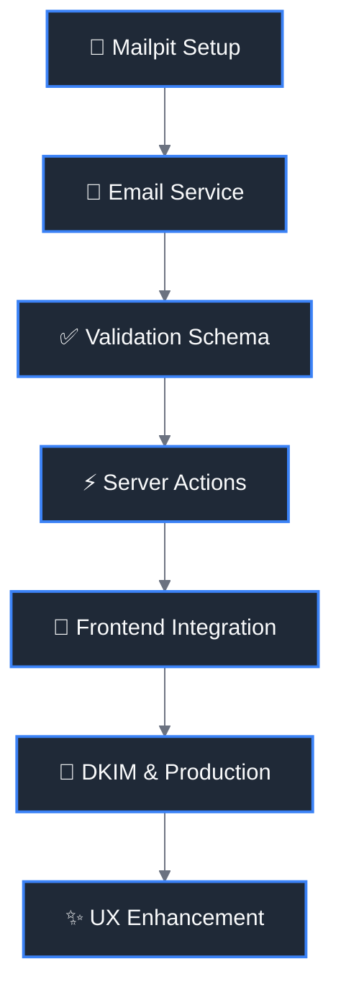

# Contact Form Migration Documentation

## 📋 Project Overview

This documentation covers the completed migration of the contact form from a static GitHub Pages implementation using FormSubmit.co to a fullstack SvelteKit application with server-side form handling, email service, and enhanced user experience.

## ✅ Migration Goals - COMPLETED

- **✅ Static → Fullstack**: Successfully transformed from GitHub Pages to SvelteKit with server actions
- **✅ FormSubmit.co → Nodemailer**: Replaced external service with self-hosted email using Nodemailer
- **✅ Enhanced UX**: Users stay on-site with proper feedback, validation, and loading states
- **✅ Production Ready**: DKIM support implemented, proper email deliverability configured
- **✅ Development Workflow**: Mailpit integration completed for local testing

## 🎉 Implementation Status

**Status**: ✅ **COMPLETED** (January 2025)

### Key Components Implemented:

- **Server Actions**: [`src/routes/contact/+page.server.ts`](../../src/routes/contact/+page.server.ts)
- **Email Service**: [`src/lib/utils/email-service.ts`](../../src/lib/utils/email-service.ts)
- **Form Validation**: [`src/lib/utils/contact-form-validation.ts`](../../src/lib/utils/contact-form-validation.ts)
- **Frontend Component**: [`src/routes/contact/+page.svelte`](../../src/routes/contact/+page.svelte)
- **Comprehensive Testing**: [`tests/integration/`](../../tests/integration/) and [`tests/e2e/`](../../tests/e2e/)

## 📚 Documentation Navigation

### Strategy & Planning

- [📊 Current State Analysis](01-current-state-analysis.md) - Analysis of existing implementation
- [🎯 Migration Strategy](02-migration-strategy.md) - High-level approach and decisions
- [🏗️ Architecture Design](03-architecture-design.md) - Technical architecture and patterns

### Configuration & Setup

- [⚙️ Environment Setup](04-environment-setup.md) - Development and production configuration
- [🧪 Testing Strategy](05-testing-strategy.md) - Testing approach and validation
- [🚀 Deployment Guide](06-deployment-guide.md) - Vercel deployment instructions

### Testing & Quality

- [🔬 Testing Setup Guide](09-testing-setup-guide.md) - Complete testing tools configuration
- [🔧 Troubleshooting](07-troubleshooting.md) - Common issues and solutions

### Enhancement & Planning

- [🌟 Future Enhancements](08-future-enhancements.md) - Nice-to-have features and roadmap

### Implementation Phases

- [📋 Implementation Overview](implementation/README.md) - Phase-by-phase implementation guide

## 🗺️ Implementation Roadmap

## 🚀 Implementation Overview

The migration has been successfully completed with the following architecture:

1. **Form Submission**: Modern Svelte 5 reactive form with proper UX feedback
2. **Server Processing**: SvelteKit server actions handle form validation and email sending
3. **Email Service**: Nodemailer with DKIM support for production email delivery
4. **Local Development**: Mailpit integration for testing email functionality
5. **Comprehensive Testing**: E2E and integration tests ensure reliability

### Quick Reference:

- **Contact Form**: Visit `/contact` to see the implemented form
- **Environment Setup**: Follow [Environment Setup](04-environment-setup.md) for local development
- **Testing**: Use [Testing Setup Guide](09-testing-setup-guide.md) for running tests
- **Troubleshooting**: Check [Troubleshooting](07-troubleshooting.md) for common issues

## 📝 Notes & Iterations

Each implementation phase includes space for:

- ✅ **Progress tracking** - Completed tasks and milestones
- 📝 **Implementation notes** - Discoveries and decisions made during development
- 🐛 **Issue tracking** - Problems encountered and solutions found
- 💡 **Improvements** - Optimizations and enhancements discovered

## 🔗 Related Documentation

- [Main Project Documentation](../README.md)
- [SEO Documentation](../seo/README.md)
- [Technical Architecture](../02-technical-architecture.md)

## 🎯 Future Enhancements

While the core migration is complete, see [Future Enhancements](08-future-enhancements.md) for potential improvements:

- Rate limiting and spam protection
- Email templates customization
- Analytics integration
- Multi-language email templates

---

**Last Updated**: January 7, 2025
**Version**: 2.0
**Status**: ✅ **COMPLETED**
