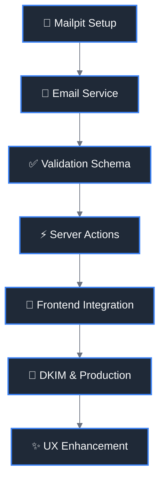

# Contact Form Migration Documentation

## 📋 Project Overview

This documentation covers the migration of the contact form from a static GitHub Pages implementation using FormSubmit.co to a fullstack SvelteKit application with server-side form handling, email service, and enhanced user experience.

## 🎯 Migration Goals

- **Static → Fullstack**: Transform from GitHub Pages to SvelteKit with server actions
- **FormSubmit.co → Nodemailer**: Replace external service with self-hosted email
- **Enhanced UX**: Keep users on-site with proper feedback and validation
- **Production Ready**: DKIM support, proper email deliverability
- **Development Workflow**: Mailpit integration for local testing

## 📚 Documentation Navigation

### Strategy & Planning

- [📊 Current State Analysis](01-current-state-analysis.md) - Analysis of existing implementation
- [🎯 Migration Strategy](02-migration-strategy.md) - High-level approach and decisions
- [🏗️ Architecture Design](03-architecture-design.md) - Technical architecture and patterns

### Configuration & Setup

- [⚙️ Environment Setup](04-environment-setup.md) - Development and production configuration
- [🧪 Testing Strategy](05-testing-strategy.md) - Testing approach and validation
- [🚀 Deployment Guide](06-deployment-guide.md) - Vercel deployment instructions

### Support & Enhancement

- [🔧 Troubleshooting](07-troubleshooting.md) - Common issues and solutions
- [🌟 Future Enhancements](08-future-enhancements.md) - Nice-to-have features and roadmap

### Implementation Phases

- [📋 Implementation Overview](implementation/README.md) - Phase-by-phase implementation guide

## 🗺️ Implementation Roadmap

## 🚀 Quick Start

1. **Read the Analysis**: Start with [Current State Analysis](01-current-state-analysis.md)
2. **Understand the Strategy**: Review [Migration Strategy](02-migration-strategy.md)
3. **Set Up Environment**: Follow [Environment Setup](04-environment-setup.md)
4. **Begin Implementation**: Start with [Phase 1: Mailpit Setup](implementation/phase-1-mailpit-setup.md)

## 📝 Notes & Iterations

Each implementation phase includes space for:

- ✅ **Progress tracking** - Completed tasks and milestones
- 📝 **Implementation notes** - Discoveries and decisions made during development
- 🐛 **Issue tracking** - Problems encountered and solutions found
- 💡 **Improvements** - Optimizations and enhancements discovered

## 🔗 Related Documentation

- [Main Project Documentation](../README.md)
- [SEO Documentation](../seo/README.md)
- [Technical Architecture](../02-technical-architecture.md)

---

**Last Updated**: December 26, 2025  
**Version**: 1.0  
**Status**: Planning Phase
