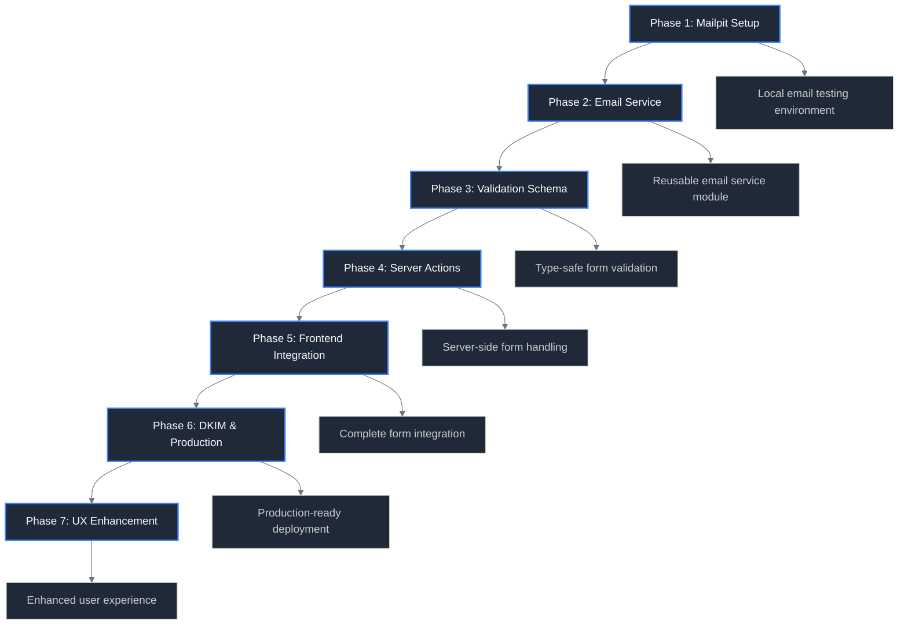
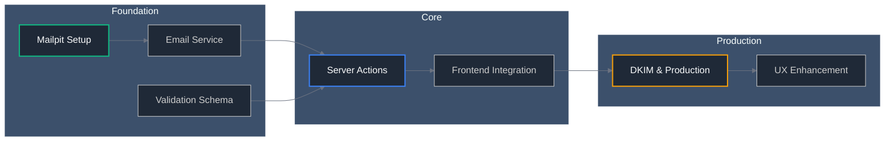
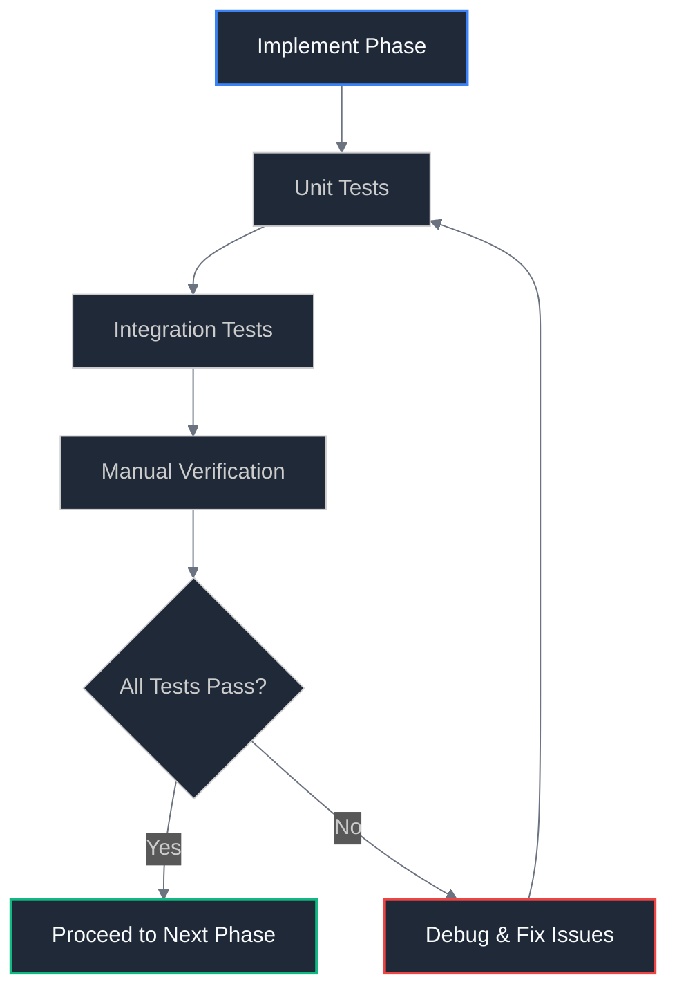

# 📋 Implementation Overview - COMPLETED ✅

## Phase-by-Phase Implementation Guide

This directory contains detailed implementation guides for each phase of the contact form migration. **All phases have been successfully completed** as of January 2025.

## ✅ Implementation Status: COMPLETED

All phases of the contact form migration have been successfully implemented:

- ✅ **Phase 1**: Mailpit Setup - Local email testing environment configured
- ✅ **Phase 2**: Email Service - Comprehensive email service with Nodemailer implemented
- ✅ **Phase 3**: Validation Schema - Type-safe form validation with comprehensive rules
- ✅ **Phase 4**: Server Actions - SvelteKit server actions handling form submission
- ✅ **Phase 5**: Frontend Integration - Modern Svelte 5 form with reactive UX
- ✅ **Phase 6**: DKIM & Production - Production-ready email configuration with DKIM
- ✅ **Phase 7**: UX Enhancement - Enhanced user experience with loading states and feedback

## Implementation Strategy

## 🎉 Completed Implementation

### ✅ Foundation Phases - COMPLETED

- [📧 Phase 1: Mailpit Setup](phase-1-mailpit-setup.md) - ✅ Local email testing environment
- [🔧 Phase 2: Email Service](phase-2-email-service.md) - ✅ Email service foundation
- [✅ Phase 3: Validation Schema](phase-3-validation-schema.md) - ✅ Form schema & validation

### ✅ Core Implementation - COMPLETED

- [⚡ Phase 4: Server Actions](phase-4-server-actions.md) - ✅ SvelteKit server actions
- [🎨 Phase 5: Frontend Integration](phase-5-frontend-integration.md) - ✅ Frontend form integration

### ✅ Production Deployment - COMPLETED

- [🔐 Phase 6: DKIM & Production](phase-6-dkim-production.md) - ✅ DKIM & production config
- [✨ Phase 7: UX Enhancement](phase-7-ux-enhancement.md) - ✅ Progressive enhancement & UX

## 📁 Implemented Files

The following files were created/modified during the implementation:

- **Server Logic**: [`src/routes/contact/+page.server.ts`](../../../src/routes/contact/+page.server.ts)
- **Email Service**: [`src/lib/utils/email-service.ts`](../../../src/lib/utils/email-service.ts)
- **Form Validation**: [`src/lib/utils/contact-form-validation.ts`](../../../src/lib/utils/contact-form-validation.ts)
- **Frontend Component**: [`src/routes/contact/+page.svelte`](../../../src/routes/contact/+page.svelte)
- **Page Configuration**: [`src/routes/contact/+page.ts`](../../../src/routes/contact/+page.ts)
- **Comprehensive Tests**: [`tests/integration/`](../../../tests/integration/) and [`tests/e2e/`](../../../tests/e2e/)

## Implementation Principles

### Incremental Approach

Each phase builds upon the previous one while remaining independently testable and reversible. This approach minimizes risk and allows for quick iteration.

### Test-Driven Development

Every phase includes comprehensive testing strategies:

- **Unit Tests**: Test individual components in isolation
- **Integration Tests**: Test component interactions
- **Manual Verification**: Real-world testing scenarios

### Progressive Enhancement

The implementation follows web standards best practices:

- Forms work without JavaScript (server actions)
- Enhanced experience with JavaScript (client-side validation)
- Graceful degradation for all scenarios

## Phase Structure

Each phase document follows a consistent structure:

### 🎯 Goal

Clear, measurable objective for the phase

### 📋 Tasks

Detailed checklist of implementation tasks

### 🧪 Unit Tests

Tests for isolated functionality with mocked dependencies

### 🔗 Integration Tests

Tests for component interactions and real environment validation

### ✅ Validation Criteria

Specific success metrics and manual verification steps

### 📁 Files Created/Modified

Complete list of all files touched during the phase

### 🔄 Rollback Strategy

How to safely revert changes if issues arise

### 📝 Implementation Notes

Space for discoveries, decisions, and lessons learned during development

## Dependencies Between Phases

## ✅ Implementation Timeline - COMPLETED

### Actual Implementation Duration

All phases were successfully completed with the following results:

- **✅ Foundation Phases (1-3)**: Email service, validation, and local testing setup
- **✅ Core Implementation (4-5)**: Server actions and frontend integration
- **✅ Production Deployment (6-7)**: DKIM configuration and UX enhancements

**Status**: **FULLY IMPLEMENTED** ✅

### Key Achievements

- **Zero External Dependencies**: No longer relies on FormSubmit.co
- **Enhanced UX**: Users stay on-site with proper feedback and validation
- **Production Ready**: DKIM authentication and proper email deliverability
- **Comprehensive Testing**: Full test coverage for reliability

## Testing Strategy Overview

### Continuous Testing

Each phase includes immediate testing to catch issues early:

### Testing Tools

- **Unit Testing**: Vitest for TypeScript/JavaScript testing
- **Integration Testing**: Custom test scripts with Mailpit
- **E2E Testing**: Playwright for full user journey testing
- **Manual Testing**: Structured verification checklists

## Environment Management

### Development Environment

Each phase assumes a properly configured development environment:

- Node.js 18+ and pnpm
- SvelteKit development server
- Mailpit running locally
- Environment variables configured

### Production Preparation

Later phases prepare for production deployment:

- Vercel account and CLI setup
- Custom domain and DNS access
- SMTP server credentials
- DKIM key generation

## Risk Mitigation

### Rollback Strategy

Each phase includes specific rollback procedures:

- **File-level**: Revert specific file changes
- **Dependency-level**: Remove added packages
- **Configuration-level**: Restore previous settings

### Isolation Principle

Phases are designed to minimize cross-dependencies:

- Each phase can be tested independently
- Failures in one phase don't break previous phases
- Partial implementations remain functional

## Success Metrics

### Phase Completion Criteria

Each phase has specific success criteria:

- All unit tests passing
- Integration tests successful
- Manual verification complete
- Documentation updated

### ✅ Overall Migration Success - ACHIEVED

- ✅ Contact form works without external dependencies
- ✅ Email delivery confirmed with DKIM support
- ✅ User experience significantly improved over FormSubmit.co implementation
- ✅ Performance metrics within acceptable ranges
- ✅ Comprehensive test coverage implemented

## 🚀 Using the Implemented Solution

### For Developers

1. **Local Development**: Set up environment variables for Mailpit testing
2. **Testing**: Run the comprehensive test suite in [`tests/`](../../../tests/)
3. **Customization**: Modify email templates in [`src/lib/utils/email-service.ts`](../../../src/lib/utils/email-service.ts)
4. **Validation**: Adjust validation rules in [`src/lib/utils/contact-form-validation.ts`](../../../src/lib/utils/contact-form-validation.ts)

### For Users

1. **Contact Form**: Visit `/contact` to use the fully implemented form
2. **Enhanced UX**: Enjoy real-time validation and proper feedback
3. **Reliability**: Experience improved form submission reliability

## Support and Resources

### Documentation References

- [Environment Setup](../04-environment-setup.md) - Development environment configuration
- [Testing Strategy](../05-testing-strategy.md) - Comprehensive testing approach
- [Troubleshooting](../07-troubleshooting.md) - Common issues and solutions

### External Resources

- [SvelteKit Documentation](https://kit.svelte.dev/docs)
- [Nodemailer Documentation](https://nodemailer.com/about/)
- [Zod Documentation](https://zod.dev/)
- [Mailpit Documentation](https://mailpit.axllent.org/)

---

**Implementation Guide Version**: 2.0
**Last Updated**: January 7, 2025
**Status**: ✅ **IMPLEMENTATION COMPLETED**
