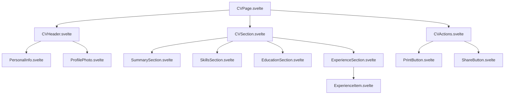

# CV Page Architecture Specification

## Overview

This document outlines the technical specification for redesigning the CV page architecture in the SvelteKit project. The new design addresses current limitations by implementing a clean separation between content and presentation, structured data format, component-based architecture, and improved PDF generation.

## Current Implementation Analysis

### Issues Identified
1. **Mixed HTML/Markdown content** - CV.md contains inline HTML styles reducing maintainability
2. **Inline styles** - Hard-coded styling mixed with content structure
3. **PDF quality issues** - jsPDF implementation produces inconsistent rendering
4. **No structured data** - Content is not easily programmatically accessible
5. **Monolithic component** - Single large component handling both display and PDF generation

### Current Tech Stack
- SvelteKit with static adapter
- Tailwind CSS + DaisyUI
- TypeScript support
- jsPDF and html2pdf.js libraries
- @tailwindcss/typography
- marked for Markdown parsing

## New Architecture Design

### 1. Data Structure

#### CV Data Schema (JSON/YAML)
```typescript
interface CVData {
  personalInfo: {
    name: string;
    email: string;
    linkedin: string;
    github: string;
    photo: string;
  };
  summary: string;
  skills: string[];
  education: Array<{
    institution: string;
    year: number;
    certification?: string;
    link?: string;
  }>;
  experience: Array<{
    id: string;
    period: string;
    title: string;
    company: string;
    location: string;
    responsibilities: string[];
  }>;
}
```

#### File Structure
```
src/lib/data/
├── cv-data.json          # Structured CV content
├── cv-schema.ts          # TypeScript interfaces
└── cv-validator.ts       # Data validation utilities
```

### 2. Component Architecture

#### Component Hierarchy


#### Component Specifications

**CVPage.svelte** (Main container)
```typescript
interface CVPageProps {
  data: CVData;
  printMode?: boolean;
}
```

**CVSection.svelte** (Reusable section wrapper)
```typescript
interface CVSectionProps {
  title: string;
  children: Snippet;
  printBreakBefore?: boolean;
}
```

**ExperienceItem.svelte** (Individual experience entry)
```typescript
interface ExperienceItemProps {
  experience: Experience;
  showDetails?: boolean;
}
```

### 3. File Organization

```
src/routes/cv/
├── +page.svelte              # Main CV page
├── +page.ts                  # Data loading
└── components/
    ├── CVHeader.svelte
    ├── CVSection.svelte
    ├── CVActions.svelte
    ├── sections/
    │   ├── SummarySection.svelte
    │   ├── SkillsSection.svelte
    │   ├── EducationSection.svelte
    │   └── ExperienceSection.svelte
    ├── ui/
    │   ├── PersonalInfo.svelte
    │   ├── ProfilePhoto.svelte
    │   ├── ExperienceItem.svelte
    │   ├── PrintButton.svelte
    │   └── ShareButton.svelte
    └── styles/
        └── cv-print.css      # Print-specific styles

src/lib/data/
├── cv-data.json
├── cv-schema.ts
└── cv-validator.ts

src/lib/utils/
└── cv-utils.ts               # Utility functions
```

### 4. PDF Generation Strategy

#### Native Browser Print Approach
- **Method**: Use `window.print()` to trigger browser's native print dialog
- **Implementation**: Optimize CSS with `@media print` rules
- **User Experience**: Click "Print PDF" → Browser print dialog → Save as PDF

#### Print CSS Optimization
```css
@media print {
  /* Page setup */
  @page {
    size: A4;
    margin: 2cm;
  }
  
  /* Hide non-essential elements */
  .cv-actions,
  .navigation {
    display: none !important;
  }
  
  /* Optimize typography */
  .cv-container {
    font-size: 12pt;
    line-height: 1.4;
  }
  
  /* Page break control */
  .cv-section {
    page-break-inside: avoid;
  }
  
  .experience-item {
    page-break-inside: avoid;
    margin-bottom: 1rem;
  }
}
```

### 5. Styling Strategy

#### Tailwind CSS Classes
- Replace all inline styles with Tailwind utility classes
- Use DaisyUI components for consistent design system
- Implement responsive design with mobile-first approach

#### CSS Architecture
```css
/* Base styles */
.cv-container {
  @apply max-w-4xl mx-auto p-6 bg-base-100;
}

.cv-header {
  @apply grid grid-cols-1 md:grid-cols-3 gap-6 mb-8;
}

.cv-section {
  @apply mb-8;
}

.cv-section-title {
  @apply text-2xl font-bold border-b-2 border-primary pb-2 mb-4;
}

/* Print-specific styles */
@media print {
  .cv-container {
    @apply max-w-none p-0 shadow-none;
  }
}
```

### 6. Implementation Approach

#### Phase 1: Data Structure Migration
1. Create CV data schema and TypeScript interfaces
2. Convert existing CV.md content to structured JSON
3. Implement data validation utilities
4. Create data loading logic in `+page.ts`

#### Phase 2: Component Development
1. Build base components (CVSection, CVHeader, CVActions)
2. Implement section-specific components
3. Create reusable UI components
4. Add print-optimized styling

#### Phase 3: PDF Generation Implementation
1. Remove jsPDF dependency
2. Implement native print functionality
3. Optimize print CSS for A4 format
4. Add print preview capabilities

#### Phase 4: Integration and Testing
1. Integrate all components in main CV page
2. Test responsive design across devices
3. Test print functionality across browsers
4. Performance optimization

### 7. Migration Strategy

#### Content Migration
```typescript
// Migration utility to convert existing CV.md to JSON
interface MigrationTools {
  parseMarkdownToStructured(markdown: string): CVData;
  validateCVData(data: CVData): boolean;
  generateMigrationReport(): MigrationReport;
}
```

#### Backward Compatibility
- Maintain existing route structure (`/cv`)
- Ensure no breaking changes to external links
- Preserve SEO metadata and social sharing

### 8. Benefits of New Architecture

#### Maintainability
- **Separation of Concerns**: Content, presentation, and logic are separated
- **Component Reusability**: CV sections can be reused in other contexts
- **Type Safety**: Full TypeScript support with proper interfaces

#### Performance
- **Smaller Bundle**: Remove jsPDF dependency (~500KB reduction)
- **Better Caching**: Structured data can be cached more effectively
- **Faster Rendering**: Native browser rendering vs library processing

#### Quality
- **Better PDF Output**: Native browser PDF generation
- **Consistent Styling**: Tailwind CSS system prevents style conflicts
- **Responsive Design**: Mobile-optimized layout

#### Developer Experience
- **Better Debugging**: Component-based architecture easier to debug
- **Easier Testing**: Individual components can be unit tested
- **Content Management**: JSON format easier to programmatically update

### 9. Technical Considerations

#### Accessibility
- Semantic HTML structure with proper heading hierarchy
- ARIA labels for interactive elements
- Keyboard navigation support
- Screen reader optimization

#### SEO
- Structured data markup (JSON-LD)
- Proper meta tags and Open Graph data
- Semantic HTML for better content understanding

#### Performance Metrics
- **Bundle Size Reduction**: ~500KB (removing jsPDF)
- **Lighthouse Score**: Target 95+ for all metrics
- **Core Web Vitals**: Optimize for LCP, FID, and CLS

### 10. Future Enhancements

#### Potential Features
- **Multiple CV Versions**: Support for different CV formats (technical, executive, etc.)
- **Dynamic Sections**: Allow hiding/showing sections based on target audience
- **Export Formats**: Add Word document export capability
- **Internationalization**: Multi-language support
- **Theme Variants**: Multiple visual themes for different industries

#### API Integration
- **CMS Integration**: Connect to headless CMS for content management
- **Analytics**: Track PDF downloads and page views
- **A/B Testing**: Test different CV layouts and content

## Conclusion

This new architecture provides a robust, maintainable, and high-quality solution for the CV page. The component-based approach with structured data and native PDF generation will significantly improve both developer experience and end-user quality while reducing technical debt and bundle size.

The implementation should be done in phases to ensure smooth migration and thorough testing at each step. The resulting system will be more scalable, performant, and easier to maintain than the current implementation.